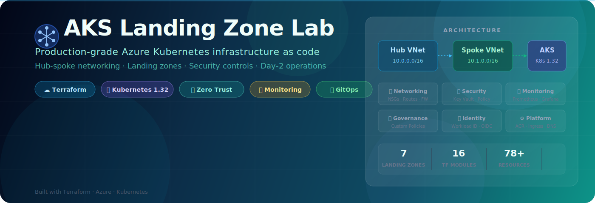
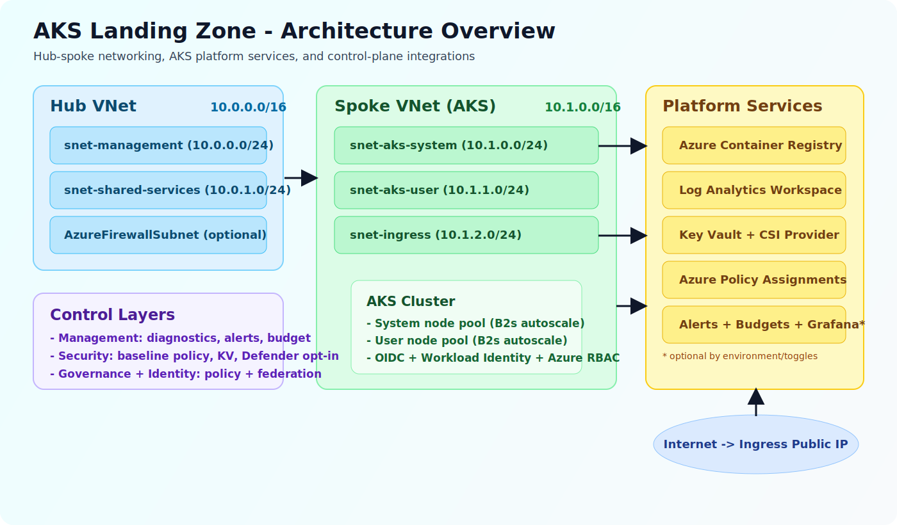

<div align="center">



<br/>

[](#-quick-start)
[](#-architecture)
[](#-architecture)
[](LICENSE)

**Enterprise-grade AKS infrastructure built with Terraform landing zones**

[Architecture](#-architecture) · [Quick Start](#-quick-start) · [Environments](#-environments) · [Docs](#-documentation) · [Lab Guide](wiki/guides/lab-guide.md)

---

</div>

## 🚀 What Is This?

A **production-ready** Azure Kubernetes Service deployment following Microsoft's [Cloud Adoption Framework](https://learn.microsoft.com/en-us/azure/cloud-adoption-framework/) and [AKS Landing Zone Accelerator](https://learn.microsoft.com/en-us/azure/cloud-adoption-framework/scenarios/app-platform/aks/landing-zone-accelerator) patterns. Everything is infrastructure as code — from hub-spoke networking to pod security policies.

> **💡 Perfect for:** Platform engineers learning enterprise AKS patterns, teams building landing zone foundations, or anyone preparing for real-world Kubernetes on Azure.

<br/>

## 🏗 Architecture

<div align="center">

</div>

<br/>

### Landing Zones

The infrastructure is organized into **six independently deployable landing zones**, each owning a specific platform concern:

<table>
<tr>
<td width="33%">

**🌐 Networking**
> Hub-spoke VNets, NSGs, route tables, VNet peering, optional Azure Firewall

</td>
<td width="33%">

**⎈ AKS Platform**
> AKS cluster with system + user pools, ACR, NGINX ingress, Azure CNI Overlay

</td>
<td width="33%">

**📈 Management**
> Log Analytics, Container Insights, alert rules, budget alerts, Prometheus + Grafana

</td>
</tr>
<tr>
<td>

**🔐 Security**
> Azure Policy baseline, Key Vault + CSI driver, Defender for Containers

</td>
<td>

**📋 Governance**
> Custom policies: deny missing limits, enforce ACR-only image sources

</td>
<td>

**🪪 Identity**
> Workload Identity Federation, managed identities, federated credentials

</td>
</tr>
</table>

### Deployment Flow

<div align="center">

</div>

<br/>

### Network Design

| Network | CIDR | Purpose |
|:--------|:-----|:--------|
| Hub VNet | `10.0.0.0/16` | Shared services, management, firewall |
| Spoke VNet | `10.1.0.0/16` | AKS system pool, user pool, ingress |
| Pod CIDR | `192.168.0.0/16` | Azure CNI Overlay pod IPs |
| Service CIDR | `172.16.0.0/16` | Kubernetes ClusterIP services |

<br/>

## ⚡ Quick Start

### Prerequisites

| Tool | Version | Required |
|:-----|:--------|:--------:|
| Azure CLI | Latest | ✅ |
| Terraform | ≥ 1.5 | ✅ |
| kubectl | Latest | ✅ |
| Helm | ≥ 3.x | ✅ |
| PowerShell | 7.x | For scripts |

### Option 1: Script Deploy (Recommended)

```powershell
# Clone and authenticate
git clone https://github.com/Jamonygr/aks-landing-zone-lab.git
cd aks-landing-zone-lab
az login
az account set --subscription "<your-subscription-id>"

# One-command deploy
.\scripts\deploy.ps1 -Environment lab
```

### Option 2: Manual Terraform

```powershell
# Initialize
terraform init

# Preview changes
terraform plan -var-file="environments/lab.tfvars"

# Deploy (~15 min)
terraform apply -var-file="environments/lab.tfvars"

# Connect to cluster
terraform output -raw kubeconfig_command | Invoke-Expression
kubectl get nodes
```

### Deploy Sample Workloads

```powershell
# Namespaces, RBAC, resource quotas
kubectl apply -f k8s/namespaces/

# Sample applications
kubectl apply -f k8s/apps/

# Verify everything is running
kubectl get pods -A
```

### Tear Down

```powershell
terraform destroy -var-file="environments/lab.tfvars"
```

<br/>

## 🌍 Environments

Three pre-built environment profiles with different feature toggles:

<table>
<tr>
<th></th>
<th align="center">🧪 Dev</th>
<th align="center">🔬 Lab</th>
<th align="center">🏭 Prod</th>
</tr>
<tr><td><b>File</b></td><td><code>environments/dev.tfvars</code></td><td><code>environments/lab.tfvars</code></td><td><code>environments/prod.tfvars</code></td></tr>
<tr><td><b>System Pool</b></td><td align="center">1 node</td><td align="center">1 node</td><td align="center">2 nodes</td></tr>
<tr><td><b>User Pool</b></td><td align="center">1–2 nodes</td><td align="center">1–3 nodes</td><td align="center">2–5 nodes</td></tr>
<tr><td><b>Firewall</b></td><td align="center">❌</td><td align="center">❌</td><td align="center">✅</td></tr>
<tr><td><b>Prometheus</b></td><td align="center">❌</td><td align="center">✅</td><td align="center">✅</td></tr>
<tr><td><b>Grafana</b></td><td align="center">❌</td><td align="center">✅</td><td align="center">✅</td></tr>
<tr><td><b>Defender</b></td><td align="center">❌</td><td align="center">❌</td><td align="center">✅</td></tr>
<tr><td><b>Flux GitOps</b></td><td align="center">❌</td><td align="center">✅</td><td align="center">✅</td></tr>
<tr><td><b>DNS Zone</b></td><td align="center">❌</td><td align="center">❌</td><td align="center">✅</td></tr>
<tr><td><b>KEDA</b></td><td align="center">❌</td><td align="center">✅</td><td align="center">✅</td></tr>
<tr><td><b>Est. Cost</b></td><td align="center">~$5/day</td><td align="center">~$8/day</td><td align="center">~$25/day</td></tr>
</table>

<br/>

## 🛠 Operational Scripts

| Script | Description |
|:-------|:------------|
| `scripts/bootstrap.ps1` | Install prerequisites, authenticate, create state backend |
| `scripts/deploy.ps1` | Full Terraform init → plan → apply pipeline |
| `scripts/destroy.ps1` | Safe teardown with confirmation prompts |
| `scripts/get-credentials.ps1` | Fetch AKS kubeconfig and verify cluster access |
| `scripts/deploy-workloads.ps1` | Apply all K8s manifests in order |
| `scripts/cleanup-workloads.ps1` | Remove deployed workloads |
| `scripts/start-lab.ps1` | Start stopped AKS cluster (resume lab) |
| `scripts/stop-lab.ps1` | Deallocate cluster to save costs overnight |
| `scripts/cost-check.ps1` | Show current resource costs and budget status |

<br/>

## 📦 Kubernetes Manifests

Pre-built manifests for learning and testing:

<table>
<tr>
<td width="50%">

**Applications** (`k8s/apps/`)
- `hello-web` — Simple web app for ingress testing
- `metrics-app` — Custom metrics endpoint for HPA
- `log-generator` — Structured logs for Log Analytics
- `multi-container` — Sidecar pattern demo
- `crashloop-pod` — Troubleshooting exercise
- `stress-cpu` / `stress-memory` — Autoscaler testing

</td>
<td width="50%">

**Platform** (`k8s/`)
- `namespaces/` — Namespaces, RBAC, quotas, limit ranges
- `autoscaling/` — HPA, KEDA, load test jobs
- `security/` — Network policies, pod security admission
- `storage/` — StorageClasses (Azure Disk, Azure Files)
- `monitoring/` — Prometheus scrape configs
- `chaos/` — Chaos Mesh experiments
- `gitops/` — Flux v2 source, kustomization, alerts

</td>
</tr>
</table>

<br/>

## 📁 Repository Structure

```
aks-landing-zone-lab/
│
├── main.tf                    # Root module — invokes all landing zones
├── variables.tf               # Input variables with descriptions
├── locals.tf                  # Computed values and naming conventions
├── outputs.tf                 # Cluster endpoints, IPs, resource IDs
├── providers.tf               # AzureRM ~>4.0, Helm, Kubernetes providers
├── backend.tf                 # Remote state configuration
├── terraform.tfvars.example   # Template for custom variables
│
├── environments/              # Pre-built variable files
│   ├── dev.tfvars
│   ├── lab.tfvars
│   └── prod.tfvars
│
├── landing-zones/             # Six platform landing zones
│   ├── networking/            #   Hub-spoke VNets, NSGs, peering
│   ├── aks-platform/          #   AKS cluster, ACR, ingress
│   ├── management/            #   Monitoring, alerts, Prometheus
│   ├── security/              #   Key Vault, policies, Defender
│   ├── governance/            #   Custom Azure Policy definitions
│   └── identity/              #   Workload Identity, managed IDs
│
├── modules/                   # Reusable Terraform modules
│   ├── aks/                   ├── networking/
│   ├── acr/                   ├── monitoring/
│   ├── keyvault/              ├── firewall/
│   ├── ingress/               ├── policy/
│   ├── rbac/                  ├── storage/
│   ├── naming/                ├── cost-management/
│   └── resource-group/        └── firewall-rules/
│
├── k8s/                       # Kubernetes manifests
│   ├── apps/                  #   Sample applications
│   ├── namespaces/            #   Namespaces, RBAC, quotas
│   ├── autoscaling/           #   HPA, KEDA, load tests
│   ├── security/              #   Network policies, PSA
│   ├── storage/               #   StorageClasses
│   ├── monitoring/            #   Scrape configs
│   ├── chaos/                 #   Chaos Mesh experiments
│   ├── gitops/                #   Flux v2 resources
│   └── backup/                #   Velero schedules
│
├── scripts/                   # PowerShell operational scripts
└── wiki/                      # Documentation, guides, and images
```

<br/>

## 🔒 Security Features

<table>
<tr>
<td>

| Layer | Controls |
|:------|:---------|
| **Network** | NSG per subnet, default-deny inbound, optional Azure Firewall |
| **Cluster** | Calico network policies, Azure RBAC for K8s |
| **Pod** | Pod Security Admission (restricted), resource limits/quotas |
| **Secrets** | Azure Key Vault + CSI Secrets Store Driver |
| **Governance** | Azure Policy: deny missing limits, enforce ACR source |
| **Runtime** | Defender for Containers (optional), audit logging |

</td>
</tr>
</table>

<br/>

## 📊 Monitoring & Observability

| Component | Details |
|:----------|:--------|
| **Log Analytics** | Centralized workspace for all diagnostic logs |
| **Container Insights** | Node/pod metrics, live container logs, recommended alerts |
| **Alert Rules** | Node CPU > 80%, pod restart count, OOM kills |
| **Prometheus** | Azure Managed Prometheus (optional, enabled in lab/prod) |
| **Grafana** | Azure Managed Grafana v11 (optional, enabled in lab/prod) |
| **Budget Alerts** | Cost threshold notifications at 80%, 100%, 120% |

<br/>

## 💰 Cost Management

| Feature | Description |
|:--------|:------------|
| **Auto-shutdown** | `stop-lab.ps1` deallocates cluster to eliminate compute costs |
| **B-series VMs** | Burstable SKUs for dev/lab to minimize baseline cost |
| **Budget alerts** | Azure Cost Management alerts at configurable thresholds |
| **Cost check** | `cost-check.ps1` shows real-time spend and forecast |
| **Optional features** | Firewall, Defender, DNS Zone only enabled where needed |

<br/>

## 📖 Documentation

<table>
<tr>
<td width="50%">

### Guides
- 📘 [Lab Guide](wiki/guides/lab-guide.md) — 8-day structured curriculum
- 🏛 [Architecture](wiki/guides/architecture.md) — Network topology and components
- 📊 [Monitoring Guide](wiki/guides/monitoring-guide.md) — Alerts, dashboards, queries
- 🔒 [Security Guide](wiki/guides/security-guide.md) — Defense-in-depth controls

</td>
<td width="50%">

### Advanced Topics
- 💰 [Cost Optimization](wiki/guides/cost-optimization.md) — Budget controls and savings
- 💥 [Chaos Guide](wiki/guides/chaos-guide.md) — Chaos Mesh fault injection
- 🔄 [GitOps Guide](wiki/guides/gitops-guide.md) — Flux v2 automation
- 🔧 [Troubleshooting](wiki/guides/troubleshooting.md) — Common issues and fixes

</td>
</tr>
</table>

<br/>

## ✅ Validation

```powershell
# Format check
terraform fmt -check -recursive

# Validate configuration
terraform validate

# View planned changes
terraform plan -var-file="environments/lab.tfvars"
```

## 🤝 Contributing

1. Fork the repository
2. Create a feature branch (`git checkout -b feature/my-feature`)
3. Commit your changes (`git commit -m 'Add my feature'`)
4. Push to the branch (`git push origin feature/my-feature`)
5. Open a Pull Request

<br/>

---

<div align="center">

**[⬆ Back to Top](#)**

<br/>

Made with ☁️ on Azure

<br/>

[](LICENSE)

</div>
