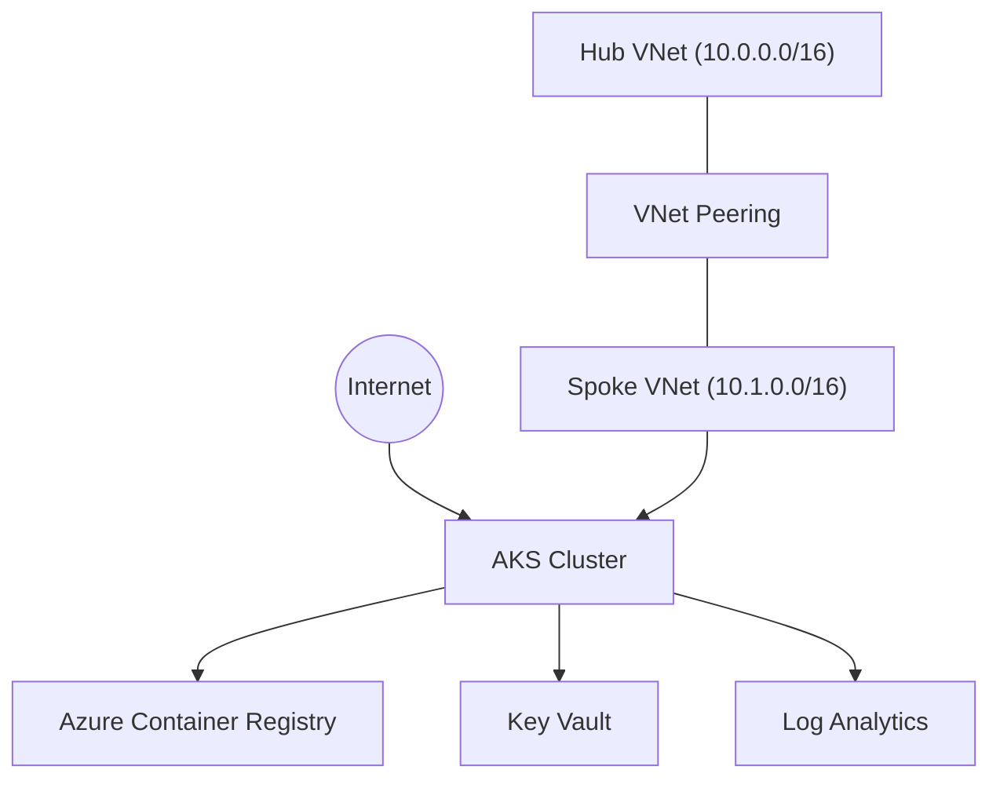

# AKS Landing Zone Lab

Terraform-based AKS lab that models an Azure landing zone style platform with hub-spoke networking, security, governance, and operations tooling.

## Architecture



## What This Deploys

- Hub and spoke virtual networks with peering
- AKS cluster with system/user pools, OIDC, workload identity, Azure RBAC
- Azure Container Registry (ACR) with AKS `AcrPull` role assignment
- NGINX ingress with static public IP
- Log Analytics, diagnostics, alerts, and budget controls
- Key Vault, CSI Secrets Store driver, policy assignments
- Optional features: Firewall, Managed Prometheus, Managed Grafana, Defender, DNS zone

## Prerequisites

- Azure subscription with rights to create networking, AKS, RBAC, and policy resources
- Azure CLI (`az`)
- Terraform `>= 1.5`
- kubectl
- Helm
- PowerShell 5.1+ (scripts are PowerShell)

## Quick Start (Scripts)

1. Bootstrap tools/login/backend:

```powershell
.\scripts\bootstrap.ps1
```

2. Deploy infrastructure:

```powershell
# dev (budget-safe)
.\scripts\deploy.ps1 -Environment dev

# lab (more features enabled)
.\scripts\deploy.ps1 -Environment lab
```

3. Get kubeconfig and verify cluster access:

```powershell
# safest: use Terraform output generated from current state
terraform output -raw kubeconfig_command
# then run the printed az aks get-credentials command

kubectl get nodes
```

4. Deploy Kubernetes lab workloads:

```powershell
.\scripts\deploy-workloads.ps1
```

5. Save costs when idle:

```powershell
.\scripts\stop-lab.ps1 -Environment dev
.\scripts\start-lab.ps1 -Environment dev
.\scripts\cost-check.ps1 -Environment dev
```

6. Tear down:

```powershell
.\scripts\cleanup-workloads.ps1 -AutoApprove
.\scripts\destroy.ps1 -Environment dev
```

## Terraform-Only Workflow

```powershell
terraform init
terraform plan  -var-file="environments/dev.tfvars"
terraform apply -var-file="environments/dev.tfvars"
```

## Environments

- `environments/dev.tfvars`: low-cost defaults
- `environments/lab.tfvars`: enables more platform features
- `environments/prod.tfvars`: reference profile with most toggles on

Important variable behavior:

- `enable_dns_zone = true` requires `dns_zone_name`
- `enable_cluster_alerts` controls cluster-specific diagnostics/alerts

## Cost Toggles

Main cost-affecting variables:

- `enable_firewall`
- `enable_managed_prometheus`
- `enable_managed_grafana`
- `enable_defender`
- `enable_dns_zone`
- `enable_azure_files`

Review current defaults in `environments/dev.tfvars`, `environments/lab.tfvars`, and `environments/prod.tfvars`.

## Repository Layout

```text
AKS/
|- main.tf / providers.tf / variables.tf / locals.tf / outputs.tf
|- backend.tf
|- environments/                 # dev, lab, prod tfvars
|- landing-zones/               # networking, aks-platform, management, security, governance, identity
|- modules/                     # reusable Terraform modules
|- k8s/                         # Kubernetes manifests (apps, security, autoscaling, storage, etc.)
|- scripts/                     # bootstrap/deploy/destroy and ops scripts
|- docs/                        # lab and operational documentation
|- wiki/                        # deeper reference pages
```

## Useful Outputs

After apply:

```powershell
terraform output
terraform output cluster_name
terraform output ingress_public_ip
terraform output kubeconfig_command
```

## Docs

- `docs/lab-guide.md`
- `docs/architecture.md`
- `docs/monitoring-guide.md`
- `docs/security-guide.md`
- `docs/cost-optimization.md`
- `docs/chaos-guide.md`
- `docs/gitops-guide.md`
- `docs/troubleshooting.md`

## Notes

- Terraform validates cleanly. You may still see one provider deprecation warning related to AKS AAD block behavior under pinned `azurerm` v3.
- Remote state is configured in `backend.tf` (Azure Storage backend).

## License

MIT
