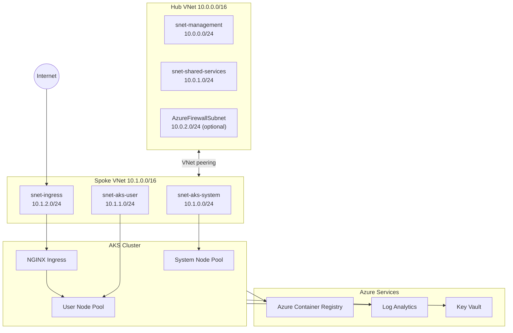

# AKS Landing Zone Lab

<p align="center">
  
</p>

<p align="center">
  =1.5" src="https://img.shields.io/badge/Terraform-%3E%3D1.5-1f2937?style=for-the-badge&logo=terraform&logoColor=white" />
  
  
  
</p>

Opinionated AKS platform lab built with Terraform and organized as landing zones: networking, AKS platform, management, security, governance, and identity.

## Contents

- [What You Get](#what-you-get)
- [Architecture](#architecture)
- [Quick Start](#quick-start)
- [Terraform Workflow](#terraform-workflow)
- [Environment Profiles](#environment-profiles)
- [Cost Controls](#cost-controls)
- [Operations Commands](#operations-commands)
- [Repository Layout](#repository-layout)
- [Validation and Known Issues](#validation-and-known-issues)
- [Documentation](#documentation)

## What You Get

| Area | Included |
|---|---|
| Networking | Hub-spoke VNets, subnet segmentation, NSGs, route tables, optional Azure Firewall |
| AKS Platform | AKS cluster with system/user pools, Azure CNI Overlay, Calico, OIDC, workload identity |
| Ingress + Registry | NGINX ingress controller with static public IP, ACR + `AcrPull` role assignment |
| Observability | Log Analytics, AKS diagnostics, metric and query-based alerts, budget alerts |
| Security | Policy baseline assignment, Key Vault, CSI Secrets Store, optional Defender |
| Governance + Identity | Custom policy definitions/assignments, managed identities, federated identity credentials |

## Architecture





## Quick Start

1. Bootstrap tools, Azure login, and Terraform backend.

```powershell
.\scripts\bootstrap.ps1
```

2. Deploy infrastructure.

```powershell
.\scripts\deploy.ps1 -Environment dev
```

3. Pull kubeconfig and verify cluster access.

```powershell
.\scripts\get-credentials.ps1 -Environment dev
kubectl get nodes
```

4. Deploy sample workloads.

```powershell
.\scripts\deploy-workloads.ps1
```

5. Pause and resume to reduce lab cost.

```powershell
.\scripts\stop-lab.ps1 -Environment dev
.\scripts\start-lab.ps1 -Environment dev
.\scripts\cost-check.ps1 -Environment dev
```

6. Destroy when finished.

```powershell
.\scripts\cleanup-workloads.ps1 -AutoApprove
.\scripts\destroy.ps1 -Environment dev
```

## Terraform Workflow

```powershell
terraform init
terraform plan  -var-file="environments/dev.tfvars"
terraform apply -var-file="environments/dev.tfvars"
terraform output kubeconfig_command
```

Useful outputs:

```powershell
terraform output cluster_name
terraform output cluster_fqdn
terraform output ingress_public_ip
terraform output acr_login_server
```

## Environment Profiles

| File | Purpose | Typical Cost Profile |
|---|---|---|
| `environments/dev.tfvars` | budget-safe defaults | lower cost |
| `environments/lab.tfvars` | broader feature coverage | medium cost |
| `environments/prod.tfvars` | reference profile with most toggles enabled | high cost |

Important behavior:

- `enable_dns_zone = true` requires `dns_zone_name`.
- Scripts currently support `dev`, `lab`, and `prod`.

## Cost Controls

Primary spend levers:

- `enable_firewall`
- `enable_managed_prometheus`
- `enable_managed_grafana`
- `enable_defender`
- `enable_dns_zone`
- `enable_cluster_alerts`

Review and tune in:

- `environments/dev.tfvars`
- `environments/lab.tfvars`
- `environments/prod.tfvars`

## Operations Commands

```powershell
# Deploy / update
.\scripts\deploy.ps1 -Environment lab

# Access cluster
.\scripts\get-credentials.ps1 -Environment lab

# Validate IaC
terraform fmt -check -recursive
terraform validate

# Cost / lifecycle
.\scripts\cost-check.ps1 -Environment lab
.\scripts\stop-lab.ps1 -Environment lab
.\scripts\start-lab.ps1 -Environment lab
```

## Repository Layout

```text
AKS/
|- backend.tf
|- providers.tf
|- main.tf
|- variables.tf
|- locals.tf
|- outputs.tf
|- environments/              # environment tfvars
|- landing-zones/             # networking, aks-platform, management, security, governance, identity
|- modules/                   # reusable Terraform modules
|- k8s/                       # Kubernetes manifests
|- scripts/                   # bootstrap, deploy, destroy, ops scripts
|- docs/                      # architecture and operations guides
|- wiki/                      # deeper reference content
```

## Validation and Known Issues

Current validation checks:

- `terraform validate` passes.
- `terraform fmt -check -recursive` currently flags `landing-zones/governance/main.tf`.
- `terraform plan -var-file="environments/lab.tfvars" -lock=false -refresh=false -no-color` currently shows pending additions (`41 to add, 0 to change, 0 to destroy`).

Known issues worth fixing before multi-environment use:

- `backend.tf` uses a single remote state key (`aks-landing-zone-lab.tfstate`) for all environments.
- Several provider deprecation warnings are present (`metric` blocks in diagnostic settings, `enable_rbac_authorization` in Key Vault).

## Documentation

- `docs/lab-guide.md`
- `docs/architecture.md`
- `docs/monitoring-guide.md`
- `docs/security-guide.md`
- `docs/cost-optimization.md`
- `docs/chaos-guide.md`
- `docs/gitops-guide.md`
- `docs/troubleshooting.md`

## License

MIT
