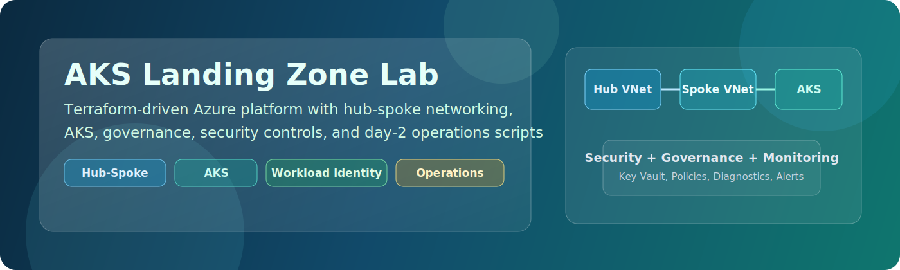

# AKS Landing Zone Lab



[](#)
[](#)
[](#)
[](LICENSE)

Enterprise AKS landing zone built with Terraform modules.

## Overview

This repository deploys a hub-spoke AKS platform using six landing zones:

- `networking`
- `aks-platform`
- `management`
- `security`
- `governance`
- `identity`

Core capabilities:

- Hub-spoke VNets with NSGs, routes, peering, optional firewall
- AKS with system/user pools, Azure CNI Overlay, Calico, Azure RBAC, OIDC
- ACR integration and NGINX ingress with static public IP
- Monitoring with Log Analytics, alerts, optional Prometheus and Grafana
- Security and governance with Key Vault and Azure Policy

## Architecture


## Prerequisites

- Azure subscription with permission to create AKS/network/RBAC/policy resources
- Azure CLI (`az`)
- Terraform `>= 1.5`
- `kubectl`
- `helm`

## Quick Start (Terraform Only)

1. Clone and sign in:

```powershell
git clone https://github.com/Jamonygr/AKS.git
cd AKS
az login
az account set --subscription "<subscription-id>"
```

2. Initialize Terraform:

```powershell
terraform init
```

3. Plan and apply (`dev` example):

```powershell
terraform plan  -var-file="environments/dev.tfvars"
terraform apply -var-file="environments/dev.tfvars"
```

4. Get cluster credentials:

```powershell
terraform output -raw kubeconfig_command
# run the printed az aks get-credentials command
kubectl get nodes
```

5. Deploy sample Kubernetes manifests (optional):

```powershell
kubectl apply -f k8s/namespaces/
kubectl apply -f k8s/apps/
```

6. Destroy when done:

```powershell
terraform destroy -var-file="environments/dev.tfvars"
```

## Environment Profiles

| Environment | File | Purpose |
|---|---|---|
| dev | `environments/dev.tfvars` | Lower-cost baseline |
| lab | `environments/lab.tfvars` | More monitoring/features |
| prod | `environments/prod.tfvars` | Reference profile |

## Common Outputs

```powershell
terraform output cluster_name
terraform output cluster_fqdn
terraform output kubeconfig_command
terraform output ingress_public_ip
terraform output acr_login_server
```

## Repository Layout

```text
AKS/
|- backend.tf
|- providers.tf
|- main.tf
|- variables.tf
|- locals.tf
|- outputs.tf
|- environments/
|- landing-zones/
|- modules/
|- k8s/
|- docs/
|- wiki/
```

## Validation

```powershell
terraform fmt -check -recursive
terraform validate
```

## Documentation

- [Lab Guide](docs/lab-guide.md)
- [Architecture](docs/architecture.md)
- [Monitoring Guide](docs/monitoring-guide.md)
- [Security Guide](docs/security-guide.md)
- [Cost Optimization](docs/cost-optimization.md)
- [Chaos Guide](docs/chaos-guide.md)
- [GitOps Guide](docs/gitops-guide.md)
- [Troubleshooting](docs/troubleshooting.md)

## License

This project is licensed under the [MIT License](LICENSE).
