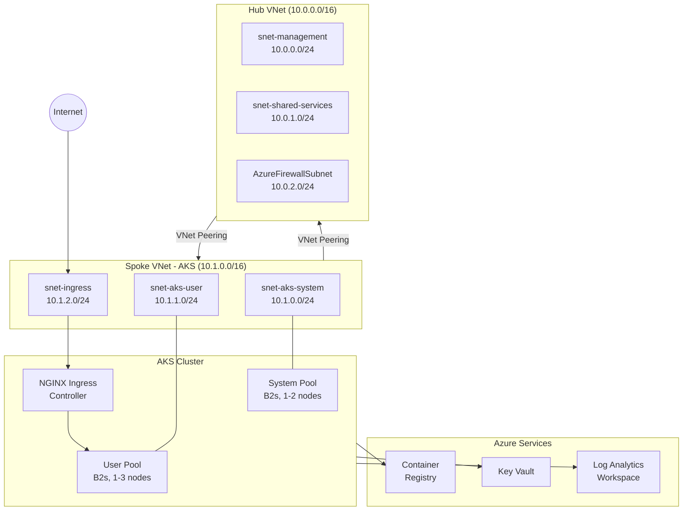
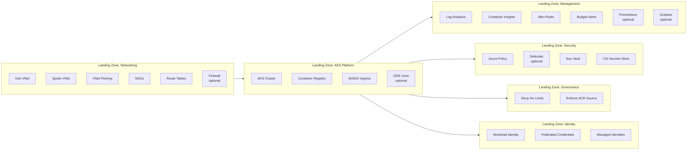

# AKS Landing Zone Architecture

## Overview

This project implements an enterprise-grade AKS deployment following the Azure [Cloud Adoption Framework (CAF)](https://learn.microsoft.com/en-us/azure/cloud-adoption-framework/) and [AKS Landing Zone Accelerator](https://learn.microsoft.com/en-us/azure/cloud-adoption-framework/scenarios/app-platform/aks/landing-zone-accelerator) patterns. The architecture uses a **hub-spoke network topology** with centralized management, security, governance, and identity landing zones.

## Network Topology



## IP Addressing Plan

### Hub VNet: 10.0.0.0/16

| Subnet | CIDR | IP Range | Usable IPs | Purpose |
|--------|------|----------|------------|---------|
| snet-management | 10.0.0.0/24 | 10.0.0.4 – 10.0.0.254 | 251 | Jump boxes, bastion hosts |
| snet-shared-services | 10.0.1.0/24 | 10.0.1.4 – 10.0.1.254 | 251 | Shared DNS, monitoring agents |
| AzureFirewallSubnet | 10.0.2.0/24 | 10.0.2.4 – 10.0.2.254 | 251 | Azure Firewall (optional) |
| *Reserved* | 10.0.3.0/24 – 10.0.255.0/24 | — | — | Future expansion |

### Spoke VNet: 10.1.0.0/16

| Subnet | CIDR | IP Range | Usable IPs | Purpose |
|--------|------|----------|------------|---------|
| snet-aks-system | 10.1.0.0/24 | 10.1.0.4 – 10.1.0.254 | 251 | AKS system node pool |
| snet-aks-user | 10.1.1.0/24 | 10.1.1.4 – 10.1.1.254 | 251 | AKS user node pool (workloads) |
| snet-ingress | 10.1.2.0/24 | 10.1.2.4 – 10.1.2.254 | 251 | Ingress controller / load balancer |
| *Reserved* | 10.1.3.0/24 – 10.1.255.0/24 | — | — | Future expansion |

### AKS Overlay Networking

| Network | CIDR | Purpose |
|---------|------|---------|
| Pod CIDR | 192.168.0.0/16 | Pod IP addresses (Azure CNI Overlay) |
| Service CIDR | 10.0.0.0/16 | Kubernetes ClusterIP services |
| DNS Service IP | 10.0.0.10 | CoreDNS service endpoint |

> **Note**: The AKS overlay network uses `192.168.0.0/16` for pod IPs, which are not routable outside the cluster. This avoids consuming VNet address space for pods while still allowing pods to reach VNet resources through the node's IP.

## Component Architecture



## Landing Zone Descriptions

### 1. Networking
The foundational layer that establishes the hub-spoke network topology. The **hub VNet** centralizes shared services like DNS and optional Azure Firewall. The **spoke VNet** hosts the AKS cluster subnets. VNet peering enables bidirectional connectivity between hub and spoke.

**Key resources**: Hub VNet, Spoke VNet, VNet Peering, NSGs (per subnet), Route Tables, Azure Firewall (optional).

### 2. AKS Platform
The compute platform layer deploying the AKS cluster with system and user node pools. Uses Azure CNI Overlay for pod networking and Calico for network policy enforcement. Includes the NGINX ingress controller for HTTP(S) traffic routing and an Azure Container Registry for container images.

**Key resources**: AKS Cluster, System Node Pool, User Node Pool, ACR (Basic), NGINX Ingress Controller, Public IP, DNS Zone (optional).

### 3. Management
The observability layer providing logging, monitoring, alerting, and cost tracking. Log Analytics Workspace is the central log sink with Container Insights for AKS-specific telemetry. Metric alerts detect node and pod health issues.

**Key resources**: Log Analytics Workspace, Container Insights, Diagnostic Settings, Metric Alerts (11 rules), Action Group, Budget Alert, Managed Prometheus (optional), Managed Grafana (optional).

### 4. Security
Enforces security baselines through Azure Policy, Key Vault for secret management, and the CSI Secrets Store Provider for pod-level secret injection. Optional Defender for Containers provides runtime threat detection.

**Key resources**: Azure Policy (Pod Security Baseline), Key Vault, CSI Secrets Store Provider, Defender for Containers (optional).

### 5. Governance
Custom Azure Policy definitions and assignments for organizational compliance. Policies audit or deny pods that lack resource limits and restrict container images to the project ACR.

**Key resources**: Custom Policy Definitions, Policy Assignments (cluster-scoped).

### 6. Identity
Workload Identity federation enabling pods to authenticate to Azure services using federated tokens rather than stored credentials. Managed identities are created for the workload and metrics-app service accounts.

**Key resources**: User-Assigned Managed Identities, Federated Identity Credentials, Storage Account (metrics demo).

## Traffic Flows

### Ingress (Internet → Application)

```
Internet
  └── Azure Load Balancer (Public IP)
        └── NGINX Ingress Controller (snet-ingress)
              └── hello-web Service (ClusterIP)
                    └── hello-web Pods (snet-aks-user)
```

1. User sends HTTP request to the public IP assigned to the Azure Load Balancer.
2. Load Balancer forwards traffic to the NGINX Ingress Controller pods running in the ingress subnet.
3. NGINX routes based on Ingress rules (hostname, path) to the target ClusterIP Service.
4. Service distributes traffic across healthy pods via kube-proxy (iptables/IPVS).

### Egress (Application → Internet)

```
Pod (overlay: 192.168.x.x)
  └── Node NAT (SNAT to node IP in 10.1.x.x)
        └── Azure Load Balancer (outbound rules)
              └── Internet
```

By default, pods egress through the Azure Load Balancer's outbound rules. With Azure Firewall enabled, all egress routes through the hub firewall for centralized inspection and logging.

### East-West (Pod → Pod)

```
Pod A (10.1.0.x / overlay 192.168.x.x)
  └── Calico Network Policy Check
        └── Pod B (same or different node)
```

Intra-cluster traffic uses the Azure CNI Overlay network. Calico evaluates network policies before allowing traffic. Default-deny policies require explicit allow rules for pod-to-pod communication.

### Hub ↔ Spoke

```
Hub VNet (10.0.0.0/16)
  ↔ VNet Peering (bidirectional)
      ↔ Spoke VNet (10.1.0.0/16)
```

VNet peering enables direct, low-latency connectivity between hub and spoke without traversing the internet. Traffic stays on the Microsoft backbone network. Route tables can optionally force spoke traffic through the hub firewall.

## Resource Group Layout

| Resource Group | Contents | Purpose |
|---|---|---|
| `rg-hub-networking-{env}` | Hub VNet, subnets, NSGs, route table, firewall | Central network services |
| `rg-spoke-aks-networking-{env}` | Spoke VNet, subnets, NSGs, route table | AKS network layer |
| `rg-management-{env}` | Log Analytics, alerts, action groups, budget | Monitoring & cost |
| `rg-security-{env}` | Key Vault, policy assignments, Defender | Security controls |
| `rg-identity-{env}` | Managed identities, federated credentials | Identity & access |
| `MC_*` (auto-created) | AKS-managed node pool resources | AKS infrastructure |

## Design Decisions

| Decision | Choice | Rationale |
|----------|--------|-----------|
| Network plugin | Azure CNI Overlay | Avoids exhausting VNet IPs for pods; pods get IPs from 192.168.0.0/16 |
| Network policy | Calico | Industry standard; supports both ingress and egress policies |
| Node VM size | Standard_B2s | Cost-effective for lab; burstable for occasional spikes |
| API server access | Public | Simplified lab access; production would use private cluster |
| ACR SKU | Basic | Sufficient for lab; no geo-replication needed |
| Key Vault | RBAC-based | Recommended over access policies; integrates with managed identities |
| Ingress | NGINX | Open-source standard; extensive community support |
| Auto-upgrade | Patch channel | Automatic security patches; manual minor version upgrades |
