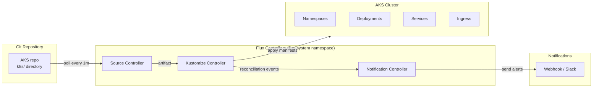

# GitOps Guide

## Overview

GitOps is an operational model where the desired state of the cluster is declared in a Git repository, and an in-cluster agent automatically reconciles the actual state to match. This lab uses [Flux v2](https://fluxcd.io/) — a CNCF graduated project — as the GitOps operator.

### Key Principles
- **Git as single source of truth** — All Kubernetes manifests live in the repo
- **Declarative desired state** — Changes are made via Git commits, not `kubectl apply`
- **Automated reconciliation** — Flux detects drift and corrects it
- **Auditability** — Every change has a Git commit history

---

## Flux v2 Architecture



### Flux Components

| Component | Purpose |
|-----------|---------|
| **Source Controller** | Polls Git repositories and Helm repos for changes; produces artifacts |
| **Kustomize Controller** | Applies Kustomizations (Kubernetes manifests) from source artifacts |
| **Notification Controller** | Sends events to external systems (Slack, webhooks, Azure DevOps) |
| **Helm Controller** | (Optional) Manages HelmRelease resources for Helm chart deployments |

---

## Setup

### Option A: Flux CLI Bootstrap (Recommended)

```powershell
# Install Flux CLI
winget install Flux.Flux

# Verify
flux --version
flux check --pre

# Bootstrap Flux into the cluster
flux bootstrap github `
  --owner=your-org `
  --repository=AKS `
  --branch=main `
  --path=k8s `
  --personal `
  --token-auth
```

This command:
1. Installs Flux controllers into the `flux-system` namespace
2. Creates a `GitRepository` source pointing to your repo
3. Creates a `Kustomization` that watches the `k8s/` path
4. Commits the Flux configuration back to the repo

### Option B: Manual Manifest Deployment

If you prefer to apply Flux manifests directly:

```powershell
# Install Flux controllers
flux install

# Apply the Git source
kubectl apply -f k8s/gitops/flux-source.yaml

# Apply the Kustomization
kubectl apply -f k8s/gitops/flux-kustomization.yaml

# Apply the notification provider
kubectl apply -f k8s/gitops/flux-notification.yaml
```

### Verify Installation

```powershell
# Check Flux system health
flux check

# List all Flux resources
kubectl get all -n flux-system

# Verify source controller is running
kubectl get pods -n flux-system -l app=source-controller
```

---

## Git Source Configuration

The `GitRepository` resource (`k8s/gitops/flux-source.yaml`) tells Flux where to find your manifests:

```yaml
apiVersion: source.toolkit.fluxcd.io/v1
kind: GitRepository
metadata:
  name: aks-landing-zone
  namespace: flux-system
spec:
  interval: 1m                  # Poll frequency
  url: https://github.com/your-org/AKS
  ref:
    branch: main                # Branch to track
  secretRef:
    name: flux-git-credentials  # For private repos
  ignore: |
    /modules/
    /landing-zones/
    /environments/
    /*.tf
    /*.md
```

### Configuration Details

| Field | Value | Purpose |
|-------|-------|---------|
| `interval` | `1m` | How often Flux checks for new commits |
| `ref.branch` | `main` | Branch to reconcile from |
| `ignore` | Terraform files, landing-zones | Only sync Kubernetes manifests (k8s/) |

### Setting Up for Private Repos

```powershell
# Create a Secret with your Git credentials
kubectl create secret generic flux-git-credentials `
  --namespace flux-system `
  --from-literal=username=git `
  --from-literal=password=<github-personal-access-token>
```

### Verifying the Source

```powershell
# Check source status
flux get sources git

# Expected output:
# NAME              REVISION        SUSPENDED  READY  MESSAGE
# aks-landing-zone  main@sha1:abc   False      True   stored artifact for revision 'main@sha1:abc...'
```

---

## Kustomization Workflow

The `Kustomization` resource (`k8s/gitops/flux-kustomization.yaml`) defines which manifests to apply and in what order:

```yaml
apiVersion: kustomize.toolkit.fluxcd.io/v1
kind: Kustomization
metadata:
  name: aks-lab-workloads
  namespace: flux-system
spec:
  interval: 5m
  sourceRef:
    kind: GitRepository
    name: aks-landing-zone
  path: ./k8s
  prune: true
  wait: true
  timeout: 5m
  healthChecks:
    - apiVersion: apps/v1
      kind: Deployment
      name: hello-web
      namespace: lab-apps
```

### Key Settings

| Field | Value | Purpose |
|-------|-------|---------|
| `interval` | `5m` | How often to reconcile (even without changes) |
| `path` | `./k8s` | Directory within the repo to apply |
| `prune` | `true` | Delete resources removed from Git |
| `wait` | `true` | Wait for resources to become ready |
| `healthChecks` | hello-web deployment | Verify specific resources are healthy |

### How Reconciliation Works

1. **Source Controller** detects a new commit on `main` branch
2. Source Controller downloads the repo content and creates an artifact
3. **Kustomize Controller** detects the new artifact
4. Kustomize Controller runs `kustomize build` on the `k8s/` path
5. Kustomize Controller applies the resulting manifests to the cluster
6. If `prune: true`, resources present in the cluster but removed from Git are deleted
7. If `wait: true`, Flux waits for all resources to become ready
8. Health checks verify specific deployments are healthy
9. **Notification Controller** sends success/failure events

### Monitoring Reconciliation

```powershell
# Check kustomization status
flux get kustomizations

# View reconciliation events
flux events

# Watch Flux logs in real-time
flux logs --follow --level=info

# Check for failed reconciliations
flux get kustomizations --status-selector ready=false
```

---

## Notification Setup

The `flux-notification.yaml` configures Flux to send events when reconciliation succeeds or fails.

### Webhook Provider

```yaml
apiVersion: notification.toolkit.fluxcd.io/v1beta3
kind: Provider
metadata:
  name: webhook-provider
  namespace: flux-system
spec:
  type: generic
  address: https://your-webhook-endpoint.example.com/flux
```

### Alert Resource

```yaml
apiVersion: notification.toolkit.fluxcd.io/v1beta3
kind: Alert
metadata:
  name: flux-alerts
  namespace: flux-system
spec:
  providerRef:
    name: webhook-provider
  eventSeverity: info
  eventSources:
    - kind: Kustomization
      name: '*'
    - kind: GitRepository
      name: '*'
```

### Supported Notification Targets

| Provider Type | Use Case |
|--------------|----------|
| `slack` | Slack channel notifications |
| `msteams` | Microsoft Teams notifications |
| `discord` | Discord channel notifications |
| `generic` | Any webhook endpoint |
| `azuredevops` | Azure DevOps pipeline status |
| `github` | GitHub commit status |

---

## Day 2 Operations with GitOps

Once Flux is running, all changes to the cluster should be made via Git commits rather than direct `kubectl apply`.

### Deploying a New Application

1. Create the manifest in `k8s/apps/my-app.yaml`
2. Commit and push to `main`:
   ```powershell
   git add k8s/apps/my-app.yaml
   git commit -m "Deploy my-app"
   git push origin main
   ```
3. Flux detects the change within 1 minute (source polling interval)
4. Kustomize Controller applies the manifest within 5 minutes (reconciliation interval)
5. Verify:
   ```powershell
   flux get kustomizations
   kubectl get pods -n lab-apps -l app=my-app
   ```

### Updating an Existing Application

1. Edit the manifest (e.g., change image tag, replica count)
2. Commit and push
3. Flux applies the change automatically

```powershell
# Example: Update hello-web to 3 replicas
# Edit k8s/apps/hello-web.yaml: set replicas: 3
git add k8s/apps/hello-web.yaml
git commit -m "Scale hello-web to 3 replicas"
git push origin main

# Watch Flux reconcile
flux logs --follow
```

### Removing an Application

1. Delete the manifest from `k8s/apps/`
2. Commit and push
3. Flux prunes (deletes) the resource from the cluster (because `prune: true`)

```powershell
git rm k8s/apps/my-app.yaml
git commit -m "Remove my-app"
git push origin main
```

### Handling Drift

If someone manually changes a resource (e.g., `kubectl scale`), Flux will detect the drift during the next reconciliation and revert it to the Git-declared state.

```powershell
# Manual change (will be reverted by Flux)
kubectl scale deployment hello-web -n lab-apps --replicas=10

# Wait for next reconciliation (up to 5 minutes)
flux get kustomizations

# Verify Flux reverted the change
kubectl get deployment hello-web -n lab-apps
# Expected: replicas = 2 (as declared in Git)
```

### Suspending Reconciliation

For maintenance or troubleshooting, you can temporarily suspend Flux:

```powershell
# Suspend reconciliation
flux suspend kustomization aks-lab-workloads

# Resume when done
flux resume kustomization aks-lab-workloads
```

---

## Troubleshooting Flux

| Issue | Command | Resolution |
|-------|---------|-----------|
| Source not ready | `flux get sources git` | Check Git URL, branch, credentials |
| Kustomization failed | `flux get kustomizations` | Check `flux logs` for manifest errors |
| Resources not syncing | `flux reconcile source git aks-landing-zone` | Force immediate reconciliation |
| Drift not corrected | `flux reconcile kustomization aks-lab-workloads` | Force re-apply from Git |
| Notifications not sending | `kubectl logs -n flux-system deploy/notification-controller` | Check provider URL and secret |
