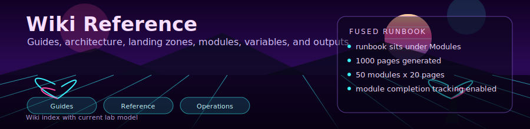

<div align="center">



# AKS Landing Zone Lab Wiki

Reference and execution docs for Terraform landing zones and the fused module runbook app.

[Landing Zones](landing-zones/README.md) | [Modules](modules/README.md) | [Guides](guides/lab-guide.md) | [Reference](reference/variables.md)

</div>

## Current Baseline

| Item | Current value |
|:--|:--|
| Terraform | `>= 1.5.0` |
| Providers | `azurerm ~> 4.0`, `helm ~> 2.12`, `random ~> 3.5` |
| Kubernetes | `1.32` |
| Landing zones | 7 (`data` optional) |
| Modules | 16 top-level + 11 nested |
| Fused runbook | 1000 pages / 50 modules / 20 pages per module |

## Navigation

### Getting Started

- `guides/lab-guide.md`
- `guides/cost-optimization.md`
- `guides/troubleshooting.md`

### Architecture

- `architecture/overview.md`
- `architecture/network-topology.md`
- `architecture/security-model.md`

### Infrastructure Reference

- `landing-zones/README.md`
- `modules/README.md`
- `reference/naming-conventions.md`
- `reference/variables.md`
- `reference/outputs.md`

### Operations Guides

- `guides/monitoring-guide.md`
- `guides/security-guide.md`
- `guides/chaos-guide.md`
- `guides/gitops-guide.md`

## Environment Snapshot

Source of truth: `environments/*.tfvars`.

| Feature | Dev | Lab | Prod |
|:--|:--:|:--:|:--:|
| Budget amount | `100` | `130` | `1200` |
| Prometheus / Grafana | Off / Off | On / On | On / On |
| Defender | Off | Off | On |
| DNS zone | Off | On | On |
| SQL database | Off | On | On |
| Firewall | Off | Off | On |
| KEDA | Off | On | On |
| Azure Files | Off | On | On |
| App Insights | Off | Off | On |

## App Runbook Model

The web app now fuses Wiki pages under Modules:

- Open `app/src/lib/wiki.ts` for generation logic.
- Runbook UI lives under `/labs` and `/labs/[page]`.
- Module completion can be auto-derived from pages or manually checked.
- Page/module progress is persisted client-side and visible in the progress panel.

## Quick Commands

```powershell
# Deploy infra
.\scripts\deploy.ps1 -Environment lab

# Build app image and deploy workloads
.\scripts\build-app.ps1 -Environment lab -Tag latest
.\scripts\deploy-workloads.ps1 -Environment lab -ImageTag latest

# Destroy lab
.\scripts\destroy.ps1 -Environment lab -AutoApprove
```

## Notes

- Scripts support `dev|lab|prod|staging`; only dev/lab/prod tfvars are included by default.
- Workload deploy validates rendered tokens and skips KEDA scaledobject when CRDs are missing.
- Destroy keeps `rg-terraform-state` by design so backend state is not deleted accidentally.
