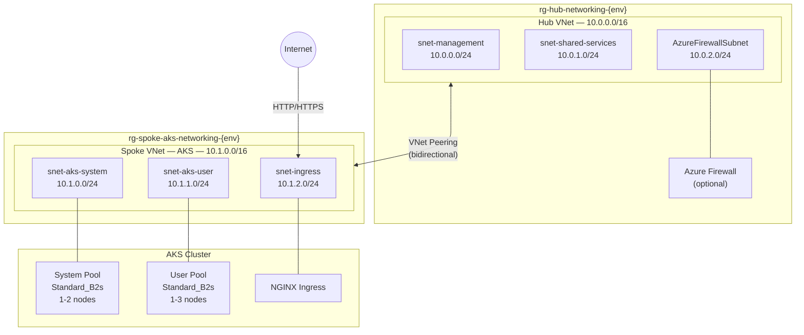

# Network Topology

## Hub-Spoke Architecture

The lab implements a hub-spoke network topology — the [recommended pattern](https://learn.microsoft.com/en-us/azure/architecture/reference-architectures/hybrid-networking/hub-spoke) for enterprise Azure deployments.



### Why Hub-Spoke?

| Benefit | Description |
|---------|-------------|
| **Centralized services** | Shared DNS, monitoring, and firewall in the hub |
| **Workload isolation** | Each spoke is an independent network boundary |
| **Scalability** | Add new spokes without modifying the hub |
| **Security** | Traffic between spokes can be forced through the hub firewall |
| **Cost efficiency** | Shared services are not duplicated per workload |

---

## IP Addressing Plan

### Hub VNet: 10.0.0.0/16

| Subnet Name | CIDR | IP Range | Usable IPs | Purpose |
|-------------|------|----------|------------|---------|
| `snet-management` | 10.0.0.0/24 | 10.0.0.4 – 10.0.0.254 | 251 | Jump boxes, bastion hosts, management VMs |
| `snet-shared-services` | 10.0.1.0/24 | 10.0.1.4 – 10.0.1.254 | 251 | Shared DNS resolvers, monitoring agents |
| `AzureFirewallSubnet` | 10.0.2.0/24 | 10.0.2.4 – 10.0.2.254 | 251 | Azure Firewall (requires this exact name) |
| *Reserved* | 10.0.3.0/24 – 10.0.255.0/24 | — | ~64,000 | Future expansion |

### Spoke VNet: 10.1.0.0/16

| Subnet Name | CIDR | IP Range | Usable IPs | Purpose |
|-------------|------|----------|------------|---------|
| `snet-aks-system` | 10.1.0.0/24 | 10.1.0.4 – 10.1.0.254 | 251 | AKS system node pool (CoreDNS, metrics-server, etc.) |
| `snet-aks-user` | 10.1.1.0/24 | 10.1.1.4 – 10.1.1.254 | 251 | AKS user node pool (application workloads) |
| `snet-ingress` | 10.1.2.0/24 | 10.1.2.4 – 10.1.2.254 | 251 | NGINX ingress controller / Azure Load Balancer |
| *Reserved* | 10.1.3.0/24 – 10.1.255.0/24 | — | ~64,000 | Future expansion |

### AKS Internal Networking

| Network | CIDR | Purpose |
|---------|------|---------|
| Pod CIDR (Overlay) | 192.168.0.0/16 | Pod IP addresses — not routable outside the cluster |
| Service CIDR | 10.0.0.0/16 | Kubernetes ClusterIP services |
| DNS Service IP | 10.0.0.10 | CoreDNS service endpoint |

> **Note on Azure CNI Overlay**: Pod IPs (192.168.x.x) are allocated from a virtual overlay network and are not visible on the VNet. Pods reach VNet resources through NAT on the node's VNet IP. This avoids the problem of exhausting VNet address space for large pod counts.

---

## VNet Peering

Two peering connections establish bidirectional connectivity:

| Peering | Source | Destination | Settings |
|---------|--------|-------------|----------|
| Hub → Spoke | `vnet-hub-{env}` | `vnet-spoke-aks-{env}` | Allow forwarded traffic, Allow gateway transit (if applicable) |
| Spoke → Hub | `vnet-spoke-aks-{env}` | `vnet-hub-{env}` | Allow forwarded traffic, Use remote gateways (if applicable) |

**Verification**:
```powershell
az network vnet peering list -g rg-hub-networking-dev --vnet-name vnet-hub-dev -o table
az network vnet peering list -g rg-spoke-aks-networking-dev --vnet-name vnet-spoke-aks-dev -o table
# Both should show PeeringState: Connected
```

---

## Network Security Groups (NSGs)

Each subnet has a dedicated NSG with explicit allow/deny rules.

### NSG: nsg-aks-system-{env}

| Priority | Direction | Action | Protocol | Port | Source | Destination | Purpose |
|----------|-----------|--------|----------|------|--------|-------------|---------|
| 100 | Inbound | Allow | TCP | 443 | VirtualNetwork | * | HTTPS from within VNet |
| 4096 | Inbound | Deny | * | * | * | * | Deny all other inbound |

### NSG: nsg-aks-user-{env}

| Priority | Direction | Action | Protocol | Port | Source | Destination | Purpose |
|----------|-----------|--------|----------|------|--------|-------------|---------|
| 100 | Inbound | Allow | TCP | 80 | VirtualNetwork | * | HTTP from within VNet |
| 110 | Inbound | Allow | TCP | 443 | VirtualNetwork | * | HTTPS from within VNet |
| 4096 | Inbound | Deny | * | * | * | * | Deny all other inbound |

### NSG: nsg-ingress-{env}

| Priority | Direction | Action | Protocol | Port | Source | Destination | Purpose |
|----------|-----------|--------|----------|------|--------|-------------|---------|
| 100 | Inbound | Allow | TCP | 80 | Internet | * | HTTP from Internet |
| 110 | Inbound | Allow | TCP | 443 | Internet | * | HTTPS from Internet |
| 4096 | Inbound | Deny | * | * | * | * | Deny all other inbound |

> **Note**: NSGs operate at the subnet level (Layer 4). For pod-level (Layer 3/4) network segmentation, Calico Network Policies are used inside the AKS cluster.

---

## Traffic Flows

### 1. Ingress: Internet → Application

```
User (Internet)
  │
  ▼
Azure Load Balancer (Public IP)
  │  (port 80/443)
  ▼
snet-ingress (10.1.2.0/24)
  │  NSG: Allow HTTP/HTTPS from Internet
  ▼
NGINX Ingress Controller Pod
  │  Ingress rules match host/path
  ▼
ClusterIP Service (hello-web)
  │  kube-proxy routes to healthy pod
  ▼
hello-web Pod (snet-aks-user)
```

### 2. Egress: Application → Internet

**Default (no firewall)**:
```
Pod (overlay 192.168.x.x)
  │  SNAT to node IP (10.1.x.x)
  ▼
Azure Load Balancer (Outbound Rule)
  │  SNAT to public IP
  ▼
Internet
```

**With Azure Firewall enabled**:
```
Pod (overlay 192.168.x.x)
  │  SNAT to node IP (10.1.x.x)
  ▼
Route Table (UDR: 0.0.0.0/0 → Firewall)
  │
  ▼
Hub VNet → AzureFirewallSubnet
  │  Network/Application rules evaluated
  ▼
Azure Firewall (Public IP)
  │  SNAT to firewall public IP
  ▼
Internet
```

### 3. East-West: Pod → Pod (Same Cluster)

```
Pod A (192.168.x.x)
  │  Calico Network Policy evaluation
  ▼
Pod B (192.168.y.y)
  (same node: through Linux bridge)
  (different node: through VXLAN/node-to-node overlay)
```

Network policies determine whether the traffic is allowed:
- `default-deny-all` blocks everything
- Explicit allow rules enable specific flows

### 4. Hub ↔ Spoke

```
Hub Resource (10.0.x.x)
  │  VNet Peering (Microsoft backbone)
  ▼
Spoke Resource (10.1.x.x)
```

- Traffic never traverses the public internet
- Latency: <1ms (same region)
- No bandwidth constraints (Azure backbone)

---

## Route Tables

### Spoke Route Table: rt-spoke-{env}

| Name | Address Prefix | Next Hop | Condition |
|------|---------------|----------|-----------|
| default-internet | 0.0.0.0/0 | Internet | Firewall OFF |
| to-hub-firewall | 0.0.0.0/0 | VirtualAppliance (Firewall IP) | Firewall ON |
| to-hub-vnet | 10.0.0.0/16 | VNetPeering | Always |

> When `enable_firewall = true`, all egress traffic is forced through the hub firewall via a User-Defined Route (UDR). This enables centralized logging and rule enforcement for outbound traffic.

---

## Diagnostic Settings

Network resources send diagnostic logs to the Log Analytics Workspace:

| Resource | Log Categories |
|----------|---------------|
| Hub VNet | VMProtectionAlerts, AllMetrics |
| Spoke VNet | VMProtectionAlerts, AllMetrics |
| NSGs | NetworkSecurityGroupEvent, NetworkSecurityGroupRuleCounter |
| NSG Flow Logs | FlowLogFlowEvent (v2, traffic analytics enabled) |
| Azure Firewall (optional) | AzureFirewallApplicationRule, AzureFirewallNetworkRule, AzureFirewallDnsProxy |

### NSG Flow Log Analytics

NSG Flow Logs v2 with Traffic Analytics provide:
- Top talkers (most active source/destination pairs)
- Allowed vs. denied traffic ratios
- Geographic flow mapping
- Unusual traffic patterns

Query example:
```kql
AzureNetworkAnalytics_CL
| where TimeGenerated > ago(1h)
| summarize FlowCount = count() by FlowDirection_s, FlowStatus_s, bin(TimeGenerated, 5m)
| render timechart
```
