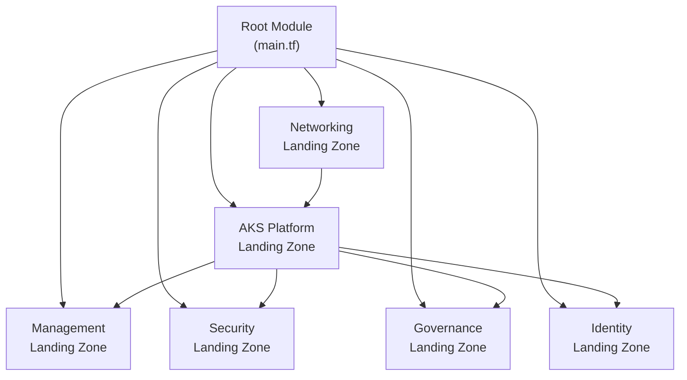
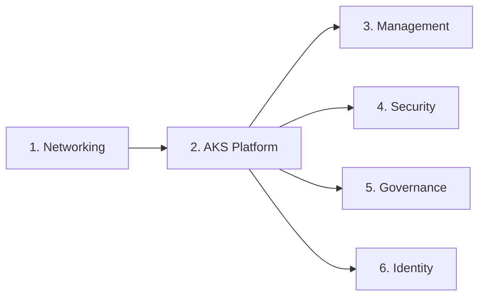

# Architecture Overview

The AKS Landing Zone Lab implements an enterprise-grade Azure Kubernetes Service deployment following Microsoft's [Cloud Adoption Framework](https://learn.microsoft.com/en-us/azure/cloud-adoption-framework/) and [AKS Landing Zone Accelerator](https://learn.microsoft.com/en-us/azure/cloud-adoption-framework/scenarios/app-platform/aks/landing-zone-accelerator) patterns.

## Design Philosophy

The architecture is organized around **landing zones** — purpose-built environments that provide specific capabilities:

Each landing zone is an independent Terraform module in `landing-zones/` that consumes reusable modules from `modules/`.

## Key Components

| Component | Technology | Purpose |
|-----------|-----------|---------|
| Network Topology | Hub-Spoke VNets | Centralized networking with isolated workload networks |
| Compute | AKS (Kubernetes 1.29) | Container orchestration with system + user node pools |
| Networking | Azure CNI Overlay + Calico | Pod networking without exhausting VNet IPs; network policy |
| Ingress | NGINX Ingress Controller | HTTP(S) traffic routing |
| Registry | Azure Container Registry (Basic) | Container image storage |
| Monitoring | Log Analytics + Container Insights | Centralized logging and observability |
| Security | Key Vault + Azure Policy + PSA | Secret management, compliance, pod security |
| Identity | Workload Identity Federation | Credential-free pod access to Azure services |
| GitOps | Flux v2 | Automated cluster state reconciliation from Git |

## Detailed Documentation

- [Network Topology](network-topology.md) — Hub-spoke design, IP addressing, traffic flows, NSGs
- [Security Model](security-model.md) — Identity, network policies, Key Vault, Defender, Azure Policy

## Infrastructure Dependencies

Landing zones are deployed in order, with each zone depending on outputs from previous zones:

1. **Networking** creates VNets, subnets, peerings, and NSGs — no dependencies
2. **AKS Platform** provisions the cluster and ACR — depends on Networking for subnet IDs
3. **Management** sets up monitoring and alerts — depends on AKS Platform for cluster ID
4. **Security** configures Key Vault and policies — depends on AKS Platform for cluster identity
5. **Governance** assigns custom Azure Policies — depends on AKS Platform for cluster ID and ACR ID
6. **Identity** creates managed identities and federated credentials — depends on AKS Platform for OIDC issuer URL

## Design Decisions

| # | Decision | Choice | Alternatives Considered | Rationale |
|---|----------|--------|------------------------|-----------|
| 1 | API Server Access | Public | Private cluster | Simplified lab access; avoids need for jump box/VPN |
| 2 | Network Plugin | Azure CNI Overlay | Kubenet, Azure CNI | Overlay avoids IP exhaustion; compatible with Calico |
| 3 | Node VM Size | Standard_B2s | Standard_D2s_v3 | Burstable VMs are cost-effective for lab workloads |
| 4 | ACR SKU | Basic | Standard, Premium | Sufficient for lab; 10 GB included storage |
| 5 | Key Vault Auth | RBAC | Access Policies | RBAC is the recommended model; integrates with managed identities |
| 6 | Firewall | Optional (OFF) | Always-on | $900/mo is prohibitive for lab; NAT gateway suffices |
| 7 | State Backend | Azure Blob Storage | Local, S3, Terraform Cloud | Native Azure integration; $0.01/mo for lab state |
| 8 | Auto-upgrade | Patch channel | None, Stable, Rapid | Automatic security patches; manual minor version control |
