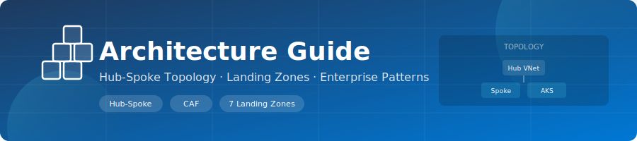

<div align="center">
  
</div>

<div align="center">

[](.)
[](.)
[](.)

</div>

# 🏗️ AKS Landing Zone Architecture

This deployment follows Azure CAF landing-zone patterns with hub-spoke networking and Terraform-managed platform boundaries.

---

## 🌐 Network And Cluster Baseline

- Hub VNet: `10.0.0.0/16`
- Spoke VNet: `10.1.0.0/16`
- AKS pod CIDR: `192.168.0.0/16` (Azure CNI Overlay)
- AKS service CIDR: `172.16.0.0/16`
- DNS service IP: `172.16.0.10`

Spoke subnets:
- `snet-aks-system` (`10.1.0.0/24`)
- `snet-aks-user` (`10.1.1.0/24`)
- `snet-ingress` (`10.1.2.0/24`)
- `snet-private-endpoints` (`10.1.3.0/24`)

Hub subnets:
- `snet-management` (`10.0.0.0/24`)
- `snet-shared-services` (`10.0.1.0/24`)
- `AzureFirewallSubnet` (`10.0.2.0/24`)
- `AzureFirewallManagementSubnet` (`10.0.3.0/24`, when firewall enabled)

---

## 🧩 Landing Zones

1. `networking`: VNets, peering, NSGs, route table, optional firewall
2. `aks-platform`: AKS, ACR, ingress, optional DNS zone
3. `management`: Log Analytics, diagnostics, alerts, budget, optional Prometheus/Grafana
4. `security`: Pod-security policy assignment, Key Vault, CSI Secrets Store, optional Defender
5. `governance`: custom policy definitions and assignments for limits and ACR image source
6. `identity`: workload identities, federated credentials, metrics storage access
7. `data` (optional): SQL database with private endpoint + private DNS + Key Vault connection string

---

## 🔗 Dependency Graph

```text
networking -> aks-platform
aks-platform -> management
aks-platform -> security
aks-platform -> governance
aks-platform -> identity
networking + management + security + identity -> data (optional)
```

---

## 🚦 Traffic Patterns

Ingress:
- Internet -> Azure Load Balancer (ingress public IP) -> ingress-nginx -> cluster services

Egress:
- Default: spoke route table sends `0.0.0.0/0` directly to Internet
- Optional: when firewall is enabled and `route_internet_via_firewall = true`, `0.0.0.0/0` uses hub firewall as next hop

East-west:
- Pod traffic on overlay network; Calico policies control allowed flows

---

## 📦 Resource Group Layout

- `rg-hub-networking-{env}`
- `rg-spoke-aks-networking-{env}`
- `rg-management-{env}`
- `rg-security-{env}`
- `rg-governance-{env}`
- `rg-identity-{env}`
- `rg-data-{env}` (when SQL enabled)
- `MC_*` node resource group (AKS-managed)

---

## ✅ Key Decisions In Current Config

- AKS version default: `1.32`
- AKS upgrade channel: `patch`
- Node OS SKU: `AzureLinux`
- ACR SKU: `Basic`
- Firewall: optional (off in `dev` and `lab`, on in `prod`)
- DNS zone: enabled in `lab` and `prod`
- SQL data zone: enabled in `lab` and `prod`

---

<div align="center">

**[⬆ Back to Wiki Home](../README.md)**

</div>
