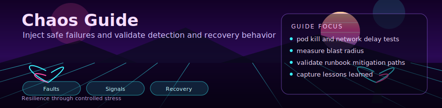

<div align="center">
  
</div>

<div align="center">

[](https://chaos-mesh.org/)
[](.)

</div>

# 💥 Chaos Guide

Chaos testing scenarios aligned to manifests under `k8s/chaos/`.

---

## 1. Install Chaos Mesh

```powershell
helm repo add chaos-mesh https://charts.chaos-mesh.org
helm repo update
helm install chaos-mesh chaos-mesh/chaos-mesh `
  --namespace chaos-testing `
  --create-namespace `
  -f k8s/chaos/chaos-mesh-values.yaml `
  --version 2.7.0
kubectl get pods -n chaos-testing
```

---

## 2. Experiment: Pod Kill

Manifest: `k8s/chaos/pod-kill-experiment.yaml`

Current behavior:
- kind: `PodChaos`
- mode: `one`
- target namespace: `lab-apps`
- selector: `environment=lab` with exclusions (`stress-cpu`, `stress-memory`, `crashloop-pod`)
- schedule: `@every 5m`
- duration: `30s`

Run:

```powershell
kubectl apply -f k8s/chaos/pod-kill-experiment.yaml
kubectl get podchaos -n lab-apps
kubectl get pods -n lab-apps -w
```

Stop:

```powershell
kubectl delete -f k8s/chaos/pod-kill-experiment.yaml
```

---

## 3. Experiment: Network Delay

Manifest: `k8s/chaos/network-delay-experiment.yaml`

Current behavior:
- kind: `NetworkChaos`
- action: `delay`
- mode: `all`
- target pods: `app=hello-web` in `lab-apps`
- latency: `100ms`, jitter: `25ms`, correlation: `50`
- direction: `both`
- duration: `5m`
- schedule: `@every 15m`

Run:

```powershell
kubectl apply -f k8s/chaos/network-delay-experiment.yaml
kubectl get networkchaos -n lab-apps
```

Stop:

```powershell
kubectl delete -f k8s/chaos/network-delay-experiment.yaml
```

---

## 4. Verify Recovery

```powershell
kubectl get pods -n lab-apps
kubectl rollout status deployment/hello-web -n lab-apps
$ip = terraform output -raw ingress_public_ip
curl "http://$ip/hello" -H "Host: hello-web.local"
```

Check events:

```powershell
kubectl get events -n lab-apps --sort-by='.lastTimestamp' | Select-Object -Last 30
```

---

## 5. Safety Rules

1. Keep scope to lab namespaces only.
2. Run one experiment at a time.
3. Have delete command ready before applying chaos.
4. Watch alerts and pod health while experiment is active.
5. Clean up experiments immediately after validation.

---

<div align="center">

**[⬅ Wiki Home](../README.md)** · **[Monitoring Guide](monitoring-guide.md)**

</div>
