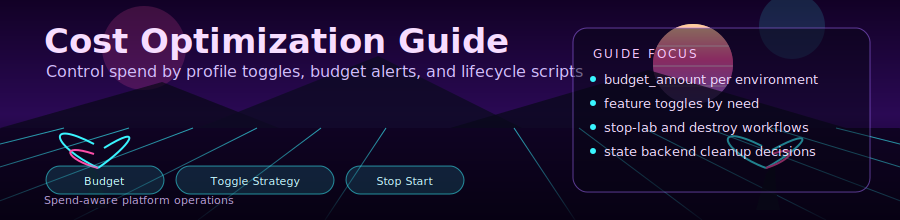

<div align="center">
  
</div>

<div align="center">

[](.)
[](.)
[](.)

</div>

# 💰 Cost Optimization Guide

Cost control practices aligned to current environment configs (`dev`, `lab`, `prod`).

---

## 1. Environment Cost Shape

Current tfvars intent:
- `dev`: minimal baseline, optional features mostly off
- `lab`: Prometheus/Grafana + DNS + SQL enabled
- `prod`: firewall + defender + advanced features enabled

Use this as your primary cost lever:

```powershell
.\scripts\deploy.ps1 -Environment dev
```

---

## 2. Optional Feature Cost Drivers

| Feature | Variable | Typical Impact |
|---------|----------|----------------|
| Azure Firewall (Basic) | `enable_firewall` | Very high |
| Defender for Containers | `enable_defender` | Per-node add-on |
| Managed Grafana | `enable_managed_grafana` | Low/medium |
| Managed Prometheus | `enable_managed_prometheus` | Low/medium depending on ingest |
| DNS Zone | `enable_dns_zone` | Low |
| SQL Database | `enable_sql_database` | Low/medium |

No direct current deployment impact (reserved root vars):
- `enable_keda`
- `enable_azure_files`
- `enable_app_insights`

Routing note:
- `route_internet_via_firewall` only changes egress path when firewall exists; it is not a standalone cost feature.

---

## 3. Highest ROI Action: Stop/Start

When not actively using the lab:

```powershell
.\scripts\stop-lab.ps1
```

Resume:

```powershell
.\scripts\start-lab.ps1
```

Automate with Task Scheduler for nights/weekends if this is your regular cadence.

---

## 4. Monitor Spend

Use the built-in script:

```powershell
.\scripts\cost-check.ps1 -Environment dev
.\scripts\cost-check.ps1 -Environment lab
```

This script reads `budget_amount` from the selected env tfvars unless explicitly overridden.

---

## 5. Budgeting Behavior In Terraform

Management landing zone config creates a resource-group budget:
- amount: `budget_amount`
- notifications at 80% actual and 100% forecasted
- contact: `alert_email`

Set explicitly in env tfvars:

```hcl
budget_amount = 100
alert_email   = "admin@example.com"
```

---

## 6. Practical Cost Checklist

- Prefer `dev` unless testing a specific feature
- Stop cluster after each lab session
- Keep firewall/defender off outside dedicated exercises
- Remove stress/chaos workloads after testing
- Periodically run `scripts/cost-check.ps1`
- Destroy environments you are not using

---

## 7. Teardown

Workloads only:

```powershell
.\scripts\cleanup-workloads.ps1
```

Full infrastructure:

```powershell
.\scripts\destroy.ps1 -Environment dev
az resource list --tag project=akslab -o table
```

---

<div align="center">

**[⬅ Wiki Home](../README.md)** · **[Troubleshooting](troubleshooting.md)**

</div>
