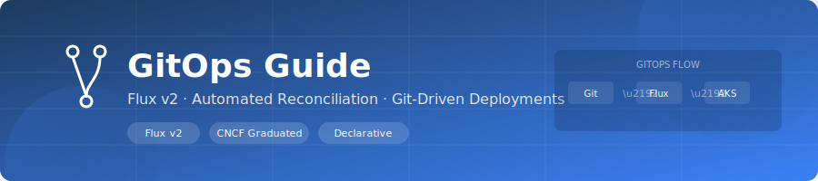

<div align="center">
  
</div>

<div align="center">

[](https://fluxcd.io/)
[](.)

</div>

# 🔄 GitOps Guide

Current GitOps setup in `k8s/gitops/*` uses Flux resources for source, kustomizations, and notifications.

---

## 1. Manifests In This Repo

- `k8s/gitops/flux-source.yaml`
  - `GitRepository` name: `aks-landing-zone`
  - interval: `1m`
- `k8s/gitops/flux-kustomization.yaml`
  - `Kustomization` names: `lab-namespaces`, `lab-security`, `lab-apps`
  - paths: `./k8s/namespaces`, `./k8s/security`, `./k8s/apps`
- `k8s/gitops/flux-notification.yaml`
  - provider: `lab-webhook` (`generic-hmac`)
  - alerts: `lab-deployment-alerts`, `lab-error-alerts`

---

## 2. Install Flux

```powershell
winget install Flux.Flux
flux --version
flux check --pre
flux install
```

Apply repo manifests:

```powershell
kubectl apply -f k8s/gitops/flux-source.yaml
kubectl apply -f k8s/gitops/flux-kustomization.yaml
kubectl apply -f k8s/gitops/flux-notification.yaml
```

---

## 3. Configure Before Use

Update these placeholders first:
- `k8s/gitops/flux-source.yaml`
  - Git URL (`spec.url`)
  - `secretRef` if private repo
- `k8s/gitops/flux-notification.yaml`
  - webhook `spec.address`
  - `webhook-hmac-secret` token

Private repo secret example:

```powershell
kubectl create secret generic flux-git-credentials `
  --namespace flux-system `
  --from-literal=username=git `
  --from-literal=password=<github-token>
```

---

## 4. Reconciliation Flow

1. Source controller polls repository (`1m`)
2. Kustomizations reconcile:
   - namespaces first
   - security next (depends on namespaces)
   - apps after source update
3. `prune: true` removes deleted Git-managed resources

---

## 5. Operations

Status:

```powershell
flux get sources git
flux get kustomizations
flux events
flux logs --follow
```

Force reconcile:

```powershell
flux reconcile source git aks-landing-zone
flux reconcile kustomization lab-namespaces
flux reconcile kustomization lab-security
flux reconcile kustomization lab-apps
```

Suspend/resume:

```powershell
flux suspend kustomization lab-apps
flux resume kustomization lab-apps
```

---

## 6. Troubleshooting

| Symptom | Check |
|---------|-------|
| Source not ready | `flux get sources git` and verify repo URL/credentials |
| Kustomization failing | `flux get kustomizations` then `flux logs --follow` |
| Notifications missing | `kubectl logs -n flux-system deploy/notification-controller` |
| Drift not corrected | Run `flux reconcile kustomization lab-apps` |

---

<div align="center">

**[⬅ Wiki Home](../README.md)** · **[Troubleshooting](troubleshooting.md)**

</div>
