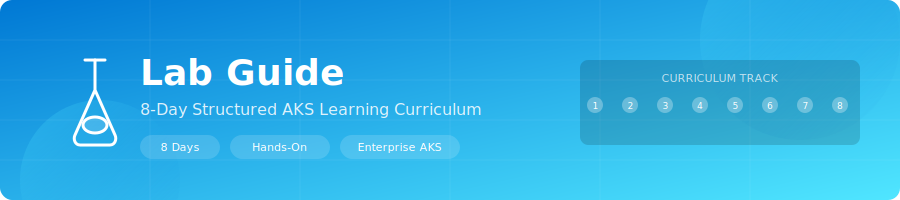

<div align="center">
  
</div>

<div align="center">

[](.)
[](.)
[](.)
[](.)

</div>

# \ud83e\uddea AKS Landing Zone Lab Guide

> **A hands-on, 8-day curriculum** for building, exploring, and operating an enterprise-grade AKS environment using hub-spoke networking, Terraform IaC, and Kubernetes best practices.

<table>
<tr>
<td width="50%">

**\ud83c\udfaf What You'll Learn**
- Deploy enterprise AKS with Terraform
- Configure hub-spoke network topology
- Implement security best practices
- Monitor with Container Insights & Prometheus

</td>
<td width="50%">

**\ud83d\udee0\ufe0f Skills Developed**
- Infrastructure as Code (Terraform)
- Kubernetes operations & debugging
- Azure networking & security
- GitOps with Flux v2

</td>
</tr>
</table>

---

## \ud83d\udccb Prerequisites

Before starting any lab day, ensure the following tools are installed:

| Tool | Version | Install |
|------|---------|---------|
| Azure CLI | 2.x+ | `winget install Microsoft.AzureCLI` |
| Terraform | 1.5+ | `winget install Hashicorp.Terraform` |
| kubectl | 1.29+ | `az aks install-cli` |
| Helm | 3.x+ | `winget install Helm.Helm` |
| Git | 2.x+ | `winget install Git.Git` |
| PowerShell | 5.1+ | Built-in on Windows |

You also need:
- An Azure Subscription with **Contributor** role
- A code editor (VS Code recommended)

---

## Day 1: Bootstrap & Deploy Infrastructure

### Objectives
- Verify all prerequisites are installed
- Create the Terraform remote state backend in Azure
- Deploy the full AKS Landing Zone infrastructure using Terraform

### Steps

#### 1.1 Clone the Repository

```powershell
git clone https://github.com/your-org/AKS.git
cd AKS
```

#### 1.2 Run the Bootstrap Script

The bootstrap script checks prerequisites, logs you into Azure, creates the storage account for Terraform remote state, and sets your subscription.

```powershell
.\scripts\bootstrap.ps1 -SubscriptionId "<your-subscription-id>"
```

**Expected output**: Green `[OK]` checks for each tool, successful Azure login, and a summary showing the state storage account name.

#### 1.3 Review the Dev Environment Configuration

Open `environments/dev.tfvars` and review the defaults:

```powershell
Get-Content .\environments\dev.tfvars
```

Key settings:
- All optional toggles are **OFF** for budget safety
- System pool: `Standard_B2s`, 1–2 nodes
- User pool: `Standard_B2s`, 1–3 nodes
- Budget: $100/mo

#### 1.4 Deploy Infrastructure

```powershell
.\scripts\deploy.ps1 -Environment dev
```

This runs `terraform init`, `plan`, and (after confirmation) `apply`. Deployment takes approximately 10–15 minutes.

#### 1.5 Verify Deployment

```powershell
# Check Terraform outputs
terraform output

# Verify resource groups were created
az group list --query "[?tags.project=='akslab']" -o table
```

### Verification Checklist
- [ ] Bootstrap script shows all green checks
- [ ] `terraform apply` completes without errors
- [ ] Resource groups `rg-hub-networking-dev`, `rg-spoke-aks-networking-dev`, `rg-management-dev`, `rg-security-dev` exist
- [ ] AKS cluster `aks-akslab-dev` is in `Succeeded` state

### Expected Outcome
Three resource groups created with hub VNet, spoke VNet, AKS cluster, ACR, Log Analytics workspace, and Key Vault.

---

## Day 2: Hub-Spoke Networking

### Objectives
- Understand the hub-spoke network topology
- Verify VNet peering between hub and spoke
- Inspect NSG rules and route tables
- Test connectivity between networks

### Steps

#### 2.1 Explore the Hub VNet

```powershell
az network vnet show --resource-group rg-hub-networking-dev --name vnet-hub-dev -o table

# List hub subnets
az network vnet subnet list --resource-group rg-hub-networking-dev --vnet-name vnet-hub-dev -o table
```

**Expected subnets**:
| Subnet | CIDR | Purpose |
|--------|------|---------|
| snet-management | 10.0.0.0/24 | Jump boxes, bastion |
| snet-shared-services | 10.0.1.0/24 | Shared services (DNS, etc.) |
| AzureFirewallSubnet | 10.0.2.0/24 | Azure Firewall (optional) |

#### 2.2 Explore the Spoke VNet

```powershell
az network vnet show --resource-group rg-spoke-aks-networking-dev --name vnet-spoke-aks-dev -o table

# List spoke subnets
az network vnet subnet list --resource-group rg-spoke-aks-networking-dev --vnet-name vnet-spoke-aks-dev -o table
```

**Expected subnets**:
| Subnet | CIDR | Purpose |
|--------|------|---------|
| snet-aks-system | 10.1.0.0/24 | AKS system node pool |
| snet-aks-user | 10.1.1.0/24 | AKS user node pool |
| snet-ingress | 10.1.2.0/24 | NGINX ingress controller |

#### 2.3 Verify VNet Peering

```powershell
# Check peering state (should be "Connected")
az network vnet peering list --resource-group rg-hub-networking-dev --vnet-name vnet-hub-dev -o table
az network vnet peering list --resource-group rg-spoke-aks-networking-dev --vnet-name vnet-spoke-aks-dev -o table
```

Both peerings should show `PeeringState: Connected`.

#### 2.4 Inspect NSG Rules

```powershell
# Show NSG rules for the AKS system subnet
az network nsg rule list --resource-group rg-spoke-aks-networking-dev --nsg-name nsg-aks-system-dev -o table

# Show NSG rules for the ingress subnet
az network nsg rule list --resource-group rg-spoke-aks-networking-dev --nsg-name nsg-ingress-dev -o table
```

#### 2.5 Test Connectivity (from within a pod)

```powershell
# Get cluster credentials first
.\scripts\get-credentials.ps1

# Deploy a test pod and run connectivity checks
kubectl run dns-test --image=busybox:1.36 --restart=Never -- sleep 3600
kubectl exec dns-test -- nslookup kubernetes.default.svc.cluster.local
kubectl exec dns-test -- wget -qO- --timeout=5 http://hello-web.lab-apps.svc.cluster.local || echo "Expected: service not yet deployed"
kubectl delete pod dns-test
```

### Verification Checklist
- [ ] Hub VNet has 3 subnets in the 10.0.x.0/24 range
- [ ] Spoke VNet has 3 subnets in the 10.1.x.0/24 range
- [ ] Both peerings show `Connected` state
- [ ] NSGs have deny-all-inbound as lowest priority rule
- [ ] DNS resolution works from within pods

### Expected Outcome
Full understanding of the hub-spoke topology, with verified peering and NSG rules protecting each subnet.

---

## Day 3: AKS Cluster Basics

### Objectives
- Connect to the AKS cluster with kubectl
- Explore cluster components (nodes, namespaces, system pods)
- Deploy the hello-web sample application
- Access the application via Ingress

### Steps

#### 3.1 Get Cluster Credentials

```powershell
.\scripts\get-credentials.ps1
# or manually:
az aks get-credentials --resource-group rg-spoke-aks-networking-dev --name aks-akslab-dev
```

#### 3.2 Explore the Cluster

```powershell
# Check cluster info
kubectl cluster-info

# List nodes and their roles
kubectl get nodes -o wide

# List all namespaces
kubectl get namespaces

# View system pods
kubectl get pods -n kube-system
```

#### 3.3 Deploy Namespaces and Workloads

```powershell
# Create lab namespaces
kubectl apply -f k8s/namespaces/namespaces.yaml

# Apply resource quotas and limit ranges
kubectl apply -f k8s/namespaces/resource-quotas.yaml
kubectl apply -f k8s/namespaces/limit-ranges.yaml

# Deploy hello-web
kubectl apply -f k8s/apps/hello-web.yaml
```

#### 3.4 Verify hello-web Deployment

```powershell
# Check deployment status
kubectl get deployments -n lab-apps
kubectl get pods -n lab-apps -l app=hello-web
kubectl get svc -n lab-apps

# Watch pods become ready
kubectl rollout status deployment/hello-web -n lab-apps --timeout=60s

# Check the ingress
kubectl get ingress -n lab-apps
```

#### 3.5 Access the Application

```powershell
# Get the ingress public IP
$ingressIP = kubectl get svc -n ingress-nginx ingress-nginx-controller -o jsonpath='{.status.loadBalancer.ingress[0].ip}'
Write-Host "Application URL: http://$ingressIP"

# Test with curl
curl "http://$ingressIP" -H "Host: hello-web.local"
```

#### 3.6 Deploy Additional Workloads (Optional)

```powershell
# Deploy all sample workloads at once
.\scripts\deploy-workloads.ps1

# Or deploy individually:
kubectl apply -f k8s/apps/log-generator.yaml
kubectl apply -f k8s/apps/dns-test.yaml
kubectl apply -f k8s/apps/multi-container.yaml
```

### Verification Checklist
- [ ] `kubectl get nodes` shows 2+ nodes in `Ready` state
- [ ] `lab-apps`, `lab-monitoring`, `lab-ingress`, `lab-security` namespaces exist
- [ ] hello-web deployment has 2/2 replicas ready
- [ ] Ingress returns HTTP 200 with nginx welcome page
- [ ] Resource quotas are applied to each namespace

### Expected Outcome
A running AKS cluster with hello-web accessible via the NGINX ingress controller's public IP.

---

## Day 4: Monitoring

### Objectives
- Verify Container Insights is collecting data
- Run KQL queries in Log Analytics
- Explore AKS diagnostic logs
- Trigger and observe alerts

### Steps

#### 4.1 Verify Container Insights

```powershell
# Check OMS agent pods
kubectl get pods -n kube-system -l component=oms-agent

# Open Azure Portal > AKS cluster > Insights
# You should see CPU, memory, and node charts
```

Navigate to the Azure Portal:
1. Go to your AKS cluster → **Insights** → **Cluster** tab
2. Verify you see node CPU/memory utilization graphs
3. Switch to **Containers** tab to see running pods

#### 4.2 Run KQL Queries in Log Analytics

Go to **Log Analytics workspace** → **Logs** and run these queries:

**Pod restart count (last 24 hours)**:
```kql
KubePodInventory
| where TimeGenerated > ago(24h)
| where RestartCount > 0
| project TimeGenerated, Namespace, Name, RestartCount
| order by RestartCount desc
```

**Container logs from hello-web**:
```kql
ContainerLogV2
| where TimeGenerated > ago(1h)
| where PodName startswith "hello-web"
| project TimeGenerated, PodName, LogMessage
| order by TimeGenerated desc
| take 50
```

**Node resource utilization**:
```kql
Perf
| where TimeGenerated > ago(1h)
| where ObjectName == "K8SNode"
| where CounterName in ("cpuUsageNanoCores", "memoryRssBytes")
| summarize avg(CounterValue) by Computer, CounterName, bin(TimeGenerated, 5m)
| render timechart
```

#### 4.3 Trigger a Test Alert

```powershell
# Deploy the crashloop pod to trigger restart alerts
kubectl apply -f k8s/apps/crashloop-pod.yaml

# Watch restarts accumulate
kubectl get pods -n lab-apps -l app=crashloop-pod -w

# After 5+ restarts, check your email for alert notification
```

#### 4.4 Review Diagnostic Settings

```powershell
# List diagnostic settings on the AKS cluster
az monitor diagnostic-settings list --resource $(terraform output -raw cluster_name) --resource-group rg-spoke-aks-networking-dev --resource-type Microsoft.ContainerService/managedClusters -o table
```

Verify these log categories are enabled:
- `kube-apiserver`
- `kube-controller-manager`
- `kube-scheduler`
- `kube-audit-admin`
- `cluster-autoscaler`
- `guard`

#### 4.5 Clean Up the Crashloop Pod

```powershell
kubectl delete -f k8s/apps/crashloop-pod.yaml
```

### Verification Checklist
- [ ] Container Insights shows live data in Azure Portal
- [ ] KQL queries return results
- [ ] Diagnostic settings capture all 6 log categories
- [ ] Alert fires after crashloop-pod restarts > 5 times
- [ ] Alert email received (if alert_email configured)

### Expected Outcome
Full observability pipeline operational: logs flowing to Log Analytics, Container Insights dashboards populated, and alerts firing on pod failures.

---

## Day 5: Security

### Objectives
- Apply and test Kubernetes network policies
- Configure Pod Security Admission (PSA) labels
- Integrate Key Vault with the CSI Secrets Store Provider
- Review Azure Policy assignments

### Steps

#### 5.1 Apply Network Policies

```powershell
# Apply default-deny + allow rules
kubectl apply -f k8s/security/network-policies.yaml

# Verify policies
kubectl get networkpolicies -A
```

#### 5.2 Test Network Policy Enforcement

```powershell
# Deploy the network policy test pods
kubectl apply -f k8s/apps/network-policy-test.yaml

# Test that allowed traffic works (ingress -> lab-apps)
kubectl exec -n lab-apps deploy/network-test-client -- wget -qO- --timeout=5 http://network-test-server.lab-apps.svc.cluster.local

# Test that cross-namespace traffic is blocked by default
kubectl run test-client -n lab-monitoring --image=busybox:1.36 --restart=Never -- wget -qO- --timeout=5 http://hello-web.lab-apps.svc.cluster.local
# Expected: timeout (blocked by default-deny)
kubectl delete pod test-client -n lab-monitoring
```

#### 5.3 Pod Security Admission

```powershell
# Apply PSA labels to namespaces
kubectl apply -f k8s/security/pod-security-admission.yaml

# Verify labels
kubectl get ns lab-apps --show-labels

# Test: try to create a privileged pod (should be warned/denied)
kubectl run priv-test -n lab-apps --image=nginx --overrides='{
  "spec": {
    "containers": [{
      "name": "priv-test",
      "image": "nginx",
      "securityContext": {"privileged": true}
    }]
  }
}' --restart=Never
# Expected: Warning or rejection depending on enforcement mode
kubectl delete pod priv-test -n lab-apps --ignore-not-found
```

#### 5.4 Key Vault Integration

```powershell
# Verify the CSI Secrets Store pods
kubectl get pods -n kube-system -l app=secrets-store-csi-driver

# Deploy the secret-consumer pod
kubectl apply -f k8s/apps/secret-consumer.yaml

# Verify the pod can read secrets from Key Vault
kubectl logs -n lab-apps -l app=secret-consumer
```

#### 5.5 Review Azure Policies

```powershell
# List policy assignments on the cluster
az policy assignment list --scope $(az aks show -g rg-spoke-aks-networking-dev -n aks-akslab-dev --query id -o tsv) -o table
```

Expected policies:
- **Pod security baseline standards** (Audit mode)
- **Deny pods without resource limits** (Audit mode)

### Verification Checklist
- [ ] Default-deny network policies applied to all namespaces
- [ ] DNS egress allowed from all namespaces
- [ ] Cross-namespace traffic blocked unless explicitly allowed
- [ ] PSA labels applied (at minimum `baseline` enforce)
- [ ] Privileged pod creation is warned/denied
- [ ] secret-consumer pod reads from Key Vault successfully
- [ ] Azure Policy shows 2+ assignments on the AKS cluster

### Expected Outcome
Defense-in-depth security: network segmentation via Calico policies, pod security enforcement via PSA, secrets managed through Key Vault, and governance through Azure Policy.

---

## Day 6: Autoscaling

### Objectives
- Configure and test Horizontal Pod Autoscaler (HPA)
- Observe Cluster Autoscaler adding nodes under load
- Run a load test and watch the scaling response

### Steps

#### 6.1 Apply the HPA

```powershell
# Apply HPA for hello-web
kubectl apply -f k8s/autoscaling/hpa-hello-web.yaml

# Verify HPA is configured
kubectl get hpa -n lab-apps
```

#### 6.2 Generate Load

```powershell
# Apply the load test job
kubectl apply -f k8s/autoscaling/load-test.yaml

# Or manually generate load
kubectl run load-generator --image=busybox:1.36 --restart=Never -- /bin/sh -c "while true; do wget -q -O- http://hello-web.lab-apps.svc.cluster.local; done"
```

#### 6.3 Watch HPA Scale

```powershell
# Watch HPA metrics in real-time
kubectl get hpa -n lab-apps -w

# In another terminal, watch pod count
kubectl get pods -n lab-apps -l app=hello-web -w
```

**Expected behavior**: When CPU exceeds 50% target, HPA scales from 2 to up to 5 replicas.

#### 6.4 Observe Cluster Autoscaler

```powershell
# Check node count
kubectl get nodes

# View cluster autoscaler logs
kubectl logs -n kube-system -l app=cluster-autoscaler --tail=50

# If load is high enough, new nodes are provisioned
kubectl get nodes -w
```

**Expected**: When pod requests exceed available node capacity, Cluster Autoscaler provisions new nodes (up to `user_node_pool_max = 3`).

#### 6.5 Clean Up Load Test

```powershell
kubectl delete -f k8s/autoscaling/load-test.yaml --ignore-not-found
kubectl delete pod load-generator --ignore-not-found

# HPA will scale down after stabilization window (120s)
kubectl get hpa -n lab-apps -w
```

#### 6.6 Stress Tests (Trigger Alerts)

```powershell
# CPU stress - triggers CPU alert
kubectl apply -f k8s/apps/stress-cpu.yaml
# Wait 5 minutes, then check alerts in Azure Portal

# Memory stress - triggers OOM alert
kubectl apply -f k8s/apps/stress-memory.yaml
# Watch for OOMKilled events
kubectl get events -n lab-apps --field-selector reason=OOMKilling

# Clean up
kubectl delete -f k8s/apps/stress-cpu.yaml
kubectl delete -f k8s/apps/stress-memory.yaml
```

### Verification Checklist
- [ ] HPA shows current CPU metric and target (50%)
- [ ] Under load, pods scale from 2 to 3+ replicas
- [ ] Cluster Autoscaler logs show scaling decisions
- [ ] stress-cpu triggers Node CPU > 80% alert
- [ ] stress-memory triggers OOMKilled event/alert
- [ ] After load removal, HPA scales back down

### Expected Outcome
Understanding of both pod-level (HPA) and node-level (Cluster Autoscaler) scaling, with alerts validating resource pressure detection.

---

## Day 7: Advanced Topics

### Objectives
- Set up GitOps with Flux v2
- Run Chaos Engineering experiments with Chaos Mesh
- Observe alerting and recovery behavior

### Steps

#### 7.1 Install Flux v2

```powershell
# Install Flux CLI
winget install Flux.Flux

# Bootstrap Flux (or use AKS GitOps extension)
flux bootstrap github \
  --owner=your-org \
  --repository=AKS \
  --branch=main \
  --path=k8s \
  --personal

# Or apply the Flux manifests directly
kubectl apply -f k8s/gitops/flux-source.yaml
kubectl apply -f k8s/gitops/flux-kustomization.yaml
kubectl apply -f k8s/gitops/flux-notification.yaml
```

#### 7.2 Verify Flux Reconciliation

```powershell
# Check Flux sources
flux get sources git

# Check kustomizations
flux get kustomizations

# Watch Flux reconcile changes
flux logs --follow
```

#### 7.3 Install Chaos Mesh

```powershell
# Add Chaos Mesh Helm repo
helm repo add chaos-mesh https://charts.chaos-mesh.org
helm repo update

# Install Chaos Mesh
helm install chaos-mesh chaos-mesh/chaos-mesh \
  --namespace chaos-testing \
  --create-namespace \
  -f k8s/chaos/chaos-mesh-values.yaml
```

#### 7.4 Run Pod Kill Experiment

```powershell
# Before the experiment, check current state
kubectl get pods -n lab-apps

# Apply the pod kill experiment
kubectl apply -f k8s/chaos/pod-kill-experiment.yaml

# Watch pods being killed and recreated
kubectl get pods -n lab-apps -w

# Check event logs
kubectl get events -n lab-apps --sort-by='.lastTimestamp' | tail -20
```

**Expected**: Pods are killed and Kubernetes automatically recreates them. Alerts fire for unexpected restarts.

#### 7.5 Run Network Delay Experiment

```powershell
# Apply network delay experiment
kubectl apply -f k8s/chaos/network-delay-experiment.yaml

# Test latency
kubectl exec -n lab-apps deploy/hello-web -- wget -qO- --timeout=10 http://hello-web.lab-apps.svc.cluster.local
# Expected: increased response time
```

#### 7.6 Clean Up Experiments

```powershell
kubectl delete -f k8s/chaos/pod-kill-experiment.yaml
kubectl delete -f k8s/chaos/network-delay-experiment.yaml

# Verify recovery
kubectl get pods -n lab-apps
```

### Verification Checklist
- [ ] Flux source shows `Ready: True`
- [ ] Flux kustomization reconciles successfully
- [ ] Pod kill experiment terminates pods
- [ ] Kubernetes self-heals by recreating killed pods
- [ ] Alerts fire during chaos experiments
- [ ] Network delay experiment increases response time
- [ ] Full recovery after experiment cleanup

### Expected Outcome
GitOps pipeline delivering changes automatically, and confidence in cluster resilience through chaos experiments with observable alerting.

---

## Day 8: Operations & Cleanup

### Objectives
- Review cost management and budget alerts
- Practice backup and restore with Velero
- Perform a clean teardown of all resources
- Document lessons learned

### Steps

#### 8.1 Cost Review

```powershell
# Run the cost check script
.\scripts\cost-check.ps1

# View costs in Azure Portal
# Go to: Subscription -> Cost Management -> Cost analysis
# Filter by: Tag "project" = "akslab"
```

#### 8.2 Stop/Start the Cluster (Cost Saving)

```powershell
# Stop the cluster (saves compute costs)
.\scripts\stop-lab.ps1

# Verify cluster is stopped
az aks show -g rg-spoke-aks-networking-dev -n aks-akslab-dev --query powerState.code -o tsv
# Expected: Stopped

# Start the cluster when ready to resume
.\scripts\start-lab.ps1
```

#### 8.3 Backup with Velero

```powershell
# Install Velero (if not already installed)
velero install --provider azure --bucket velero-backups --secret-file ./credentials-velero

# Create a backup of lab-apps
velero backup create lab-apps-backup --include-namespaces lab-apps

# Verify backup completed
velero backup get
velero backup describe lab-apps-backup
```

#### 8.4 Restore Exercise

```powershell
# Delete the lab-apps namespace to simulate disaster
kubectl delete namespace lab-apps

# Restore from backup
velero restore create --from-backup lab-apps-backup

# Verify restoration
velero restore get
kubectl get all -n lab-apps
```

#### 8.5 Clean Up Workloads

```powershell
# Remove all Kubernetes workloads
.\scripts\cleanup-workloads.ps1
```

#### 8.6 Destroy Infrastructure

```powershell
# Destroy all Azure resources
.\scripts\destroy.ps1 -Environment dev

# Verify all resource groups are removed
az group list --query "[?tags.project=='akslab']" -o table
# Expected: empty result
```

#### 8.7 Final Cost Verification

```powershell
# After destruction, check that no lingering resources remain
az resource list --tag project=akslab -o table
# Expected: empty result
```

### Verification Checklist
- [ ] Cost analysis shows spending within budget
- [ ] Cluster stop/start works correctly
- [ ] Velero backup completes successfully
- [ ] Velero restore recreates all resources in lab-apps
- [ ] `cleanup-workloads.ps1` removes all K8s manifests
- [ ] `destroy.ps1` removes all Azure resources
- [ ] No orphaned resources remain

### Expected Outcome
Operational proficiency in cost management, disaster recovery, and clean environment teardown. All Azure resources destroyed and no lingering costs.

---

## Quick Reference

### Common Commands

| Task | Command |
|------|---------|
| Get credentials | `.\scripts\get-credentials.ps1` |
| Deploy infra | `.\scripts\deploy.ps1 -Environment dev` |
| Deploy workloads | `.\scripts\deploy-workloads.ps1` |
| Check costs | `.\scripts\cost-check.ps1` |
| Stop cluster | `.\scripts\stop-lab.ps1` |
| Start cluster | `.\scripts\start-lab.ps1` |
| Destroy all | `.\scripts\destroy.ps1 -Environment dev` |

### Useful kubectl Commands

```powershell
kubectl get all -A                          # All resources, all namespaces
kubectl top nodes                           # Node resource usage
kubectl top pods -n lab-apps                # Pod resource usage
kubectl describe pod <name> -n lab-apps     # Pod details
kubectl logs <pod-name> -n lab-apps -f      # Stream pod logs
kubectl get events -n lab-apps --sort-by='.lastTimestamp'  # Recent events
```
