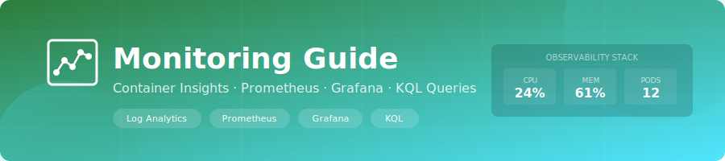

<div align="center">
  
</div>

<div align="center">

[](.)
[](.)
[](.)

</div>

# 📊 Monitoring Guide

Observability and alerting behavior for the current management landing zone.

---

## 1. What Gets Deployed

Always deployed:
- Resource group `rg-management-{env}`
- Log Analytics workspace (`30` day retention)
- Container Insights solution
- Activity log diagnostics at subscription scope
- Action group with email receiver
- Resource-group budget alerts
- Log ingestion cap alert

Conditionally deployed:
- AKS diagnostics and cluster alerts when `enable_cluster_alerts = true`
- Managed Prometheus when `enable_managed_prometheus = true`
- Managed Grafana when `enable_managed_grafana = true` (requires Prometheus)

Note:
- `log_analytics_daily_quota_gb` defaults to `1` GB/day in the management module.
- A storage account for flow logs is created, but NSG flow log resources are not currently configured in this landing zone.

---

## 2. Alert Rules In Current Config

When `enable_cluster_alerts = true`, these alert resources are created:

| Alert | Resource Type | Severity |
|-------|---------------|----------|
| `alert-node-not-ready-{env}` | Metric alert | 1 |
| `alert-cpu-high-{env}` | Metric alert | 2 |
| `alert-memory-high-{env}` | Metric alert | 2 |
| `alert-pod-restarts-{env}` | Scheduled query alert | 2 |
| `alert-failed-pods-{env}` | Scheduled query alert | 2 |
| `alert-oomkilled-{env}` | Scheduled query alert | 2 |
| `alert-api-5xx-{env}` | Scheduled query alert | 1 |
| `alert-image-pull-failure-{env}` | Scheduled query alert | 2 |

Always-on (not behind `enable_cluster_alerts`):

| Alert | Resource Type | Severity |
|-------|---------------|----------|
| `alert-log-ingestion-cap-{env}` | Scheduled query alert | 2 |

Budget notifications:
- 80% actual spend
- 100% forecasted spend

---

## 3. Diagnostics Categories

AKS diagnostics (when enabled):
- `kube-apiserver`
- `kube-controller-manager`
- `kube-scheduler`
- `kube-audit-admin`
- `guard`
- `cluster-autoscaler`
- metrics: `AllMetrics`

---

## 4. Useful Queries

Pods restarting:

```kql
KubePodInventory
| where TimeGenerated > ago(24h)
| where PodRestartCount > 0
| summarize MaxRestarts = max(PodRestartCount) by Namespace, Name
| order by MaxRestarts desc
```

Failed pods:

```kql
KubePodInventory
| where TimeGenerated > ago(24h)
| where PodStatus == "Failed"
| summarize FailedCount = count() by Namespace, Name
```

API server 5xx:

```kql
AzureDiagnostics
| where Category == "kube-apiserver"
| extend logMessage = column_ifexists("log_s", "")
| where logMessage contains "statusCode\":5"
| summarize ErrorCount = count() by bin(TimeGenerated, 5m)
```

Log ingestion volume:

```kql
Usage
| where TimeGenerated > ago(1d)
| where DataType != "Usage"
| summarize IngestedGB = sum(Quantity) / 1024.0
```

---

## 5. Optional Prometheus And Grafana

Enable in tfvars:

```hcl
enable_managed_prometheus = true
enable_managed_grafana    = true
```

After apply:

```powershell
terraform output grafana_endpoint
```

---

## 6. Quick Verification

```powershell
# Log Analytics workspace output
terraform output log_analytics_workspace_id

# Grafana output (empty when disabled)
terraform output grafana_endpoint

# List active alerts in management RG
az monitor metrics alert list -g rg-management-dev -o table
az monitor scheduled-query list -g rg-management-dev -o table
```

---

## 7. Common Issues

| Issue | Check |
|-------|-------|
| No AKS logs | Confirm `enable_cluster_alerts = true` in tfvars and re-apply |
| Empty queries right after deploy | Wait 5-15 minutes for data ingestion |
| Grafana empty/disabled | Ensure both Prometheus and Grafana toggles are true |
| Too much log cost | Reduce workload log volume or lower diagnostic coverage; module default cap is 1 GB/day |

---

<div align="center">

**[⬅ Wiki Home](../README.md)** · **[Troubleshooting](troubleshooting.md)**

</div>
