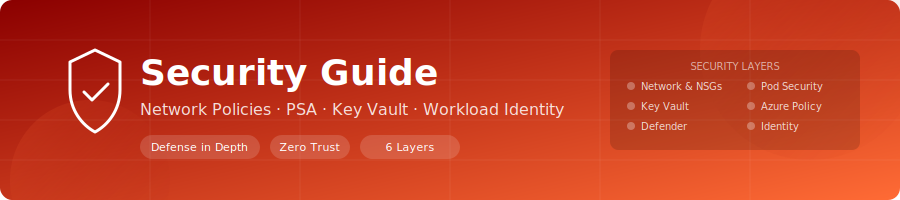

<div align="center">
  
</div>

<div align="center">

[](.)
[](.)
[](.)
[](.)

</div>

# \ud83d\udd12 Security Guide

> **Defense-in-depth security** across 6 layers — from network isolation to runtime threat detection.

---

## \ud83c\udf10 Overview

The AKS Landing Zone Lab implements defense-in-depth security across multiple layers:

| Layer | Technology | Purpose |
|-------|-----------|---------|
| Network | NSGs, Calico Network Policies | Subnet and pod-level traffic control |
| Pod | Pod Security Admission (PSA) | Restrict container privileges |
| Secrets | Azure Key Vault + CSI Driver | Externalized secret management |
| Policy | Azure Policy | Governance and compliance enforcement |
| Runtime | Defender for Containers (optional) | Threat detection and vulnerability scanning |
| Identity | Workload Identity | Credential-free Azure access from pods |

---

## Network Policy Testing

### Architecture

The lab deploys default-deny network policies per namespace using Calico (the AKS network policy engine). All inter-pod and cross-namespace traffic is blocked unless explicitly allowed.

**Deployed policies** (in `k8s/security/network-policies.yaml`):

| Policy | Namespace | Effect |
|--------|-----------|--------|
| `default-deny-all` | lab-apps | Deny all ingress and egress |
| `allow-dns-egress` | lab-apps | Allow DNS (UDP/TCP 53) |
| `allow-ingress-controller` | lab-apps | Allow ingress from nginx namespace |
| `default-deny-all` | lab-monitoring | Deny all ingress and egress |
| `allow-dns-egress` | lab-monitoring | Allow DNS |
| `default-deny-all` | lab-security | Deny all ingress and egress |
| `allow-dns-egress` | lab-security | Allow DNS |

### Testing Procedure

#### Step 1: Apply Network Policies

```powershell
kubectl apply -f k8s/security/network-policies.yaml
kubectl get networkpolicies -A
```

#### Step 2: Verify DNS Works (Allowed)

```powershell
kubectl run dns-test -n lab-apps --image=busybox:1.36 --restart=Never -- nslookup kubernetes.default
# Expected: successful name resolution
kubectl logs dns-test -n lab-apps
kubectl delete pod dns-test -n lab-apps
```

#### Step 3: Verify Cross-Namespace Traffic is Blocked

```powershell
# Try to reach a service in lab-apps from lab-monitoring
kubectl run cross-ns-test -n lab-monitoring --image=busybox:1.36 --restart=Never -- wget -qO- --timeout=5 http://hello-web.lab-apps.svc.cluster.local
# Expected: timeout (blocked by default-deny)
kubectl logs cross-ns-test -n lab-monitoring
kubectl delete pod cross-ns-test -n lab-monitoring
```

#### Step 4: Verify Ingress Traffic is Allowed

```powershell
# Traffic from ingress-nginx namespace should reach lab-apps
kubectl exec -n ingress-nginx deploy/ingress-nginx-controller -- wget -qO- --timeout=5 http://hello-web.lab-apps.svc.cluster.local
# Expected: successful response (allowed by allow-ingress-controller policy)
```

#### Step 5: Test Custom Allow Rule

Create a temporary policy to allow traffic from lab-monitoring to lab-apps:

```yaml
apiVersion: networking.k8s.io/v1
kind: NetworkPolicy
metadata:
  name: allow-from-monitoring
  namespace: lab-apps
spec:
  podSelector:
    matchLabels:
      app: hello-web
  policyTypes:
    - Ingress
  ingress:
    - from:
        - namespaceSelector:
            matchLabels:
              purpose: monitoring
```

```powershell
# Apply and retest
kubectl apply -f - <<EOF
# (paste the YAML above)
EOF

kubectl run cross-ns-test -n lab-monitoring --image=busybox:1.36 --restart=Never -- wget -qO- --timeout=5 http://hello-web.lab-apps.svc.cluster.local
# Expected: successful response (now allowed)
kubectl delete pod cross-ns-test -n lab-monitoring
kubectl delete networkpolicy allow-from-monitoring -n lab-apps
```

---

## Pod Security Admission (PSA)

### Concept

Pod Security Admission enforces [Pod Security Standards](https://kubernetes.io/docs/concepts/security/pod-security-standards/) at the namespace level using labels:

| Level | Description |
|-------|-------------|
| `privileged` | Unrestricted (no enforcement) |
| `baseline` | Prevents known privilege escalations |
| `restricted` | Heavily restricted; best practices for hardened workloads |

Each level can be set to one of three modes:

| Mode | Behavior |
|------|----------|
| `enforce` | Reject pods that violate the policy |
| `audit` | Log violations but allow the pod |
| `warn` | Emit warnings to the user but allow the pod |

### Applied Configuration

The lab sets PSA labels per namespace in `k8s/security/pod-security-admission.yaml`:

| Namespace | enforce | audit | warn |
|-----------|---------|-------|------|
| lab-apps | baseline | restricted | restricted |
| lab-monitoring | baseline | baseline | baseline |
| lab-security | restricted | restricted | restricted |

### Testing PSA

#### Test 1: Attempt a Privileged Pod

```powershell
kubectl run priv-test -n lab-apps --image=nginx:alpine --restart=Never --overrides='{
  "spec": {
    "containers": [{
      "name": "priv-test",
      "image": "nginx:alpine",
      "securityContext": {
        "privileged": true
      }
    }]
  }
}'
```

**Expected**: Pod creation is **rejected** (blocked by `baseline` enforcement) with message:
```
Error from server (Forbidden): pods "priv-test" is forbidden: violates PodSecurity "baseline:latest"
```

#### Test 2: Attempt a Pod Running as Root

```powershell
kubectl run root-test -n lab-security --image=nginx:alpine --restart=Never --overrides='{
  "spec": {
    "containers": [{
      "name": "root-test",
      "image": "nginx:alpine",
      "securityContext": {
        "runAsNonRoot": false,
        "runAsUser": 0
      }
    }]
  }
}'
```

**Expected**: Pod creation is **rejected** in `lab-security` (enforcing `restricted`).

#### Test 3: Compliant Pod

```powershell
kubectl run compliant-test -n lab-apps --image=nginx:alpine --restart=Never --overrides='{
  "spec": {
    "containers": [{
      "name": "compliant-test",
      "image": "nginx:alpine",
      "securityContext": {
        "allowPrivilegeEscalation": false,
        "runAsNonRoot": true,
        "runAsUser": 1000,
        "seccompProfile": {
          "type": "RuntimeDefault"
        },
        "capabilities": {
          "drop": ["ALL"]
        }
      }
    }]
  }
}'
```

**Expected**: Pod creates successfully. You may see warnings for `restricted` audit but `baseline` enforcement passes.

```powershell
# Clean up
kubectl delete pod priv-test root-test compliant-test -n lab-apps --ignore-not-found
kubectl delete pod root-test -n lab-security --ignore-not-found
```

---

## Key Vault Secret Rotation

### Architecture

```
Azure Key Vault
  └── Secrets (stored centrally)
        │
        ▼
CSI Secrets Store Provider (DaemonSet on AKS)
  └── SecretProviderClass (custom resource)
        │
        ▼
Pod Volume Mount
  └── Secrets available as files in /mnt/secrets-store/
```

### How Secrets Sync

1. A `SecretProviderClass` defines which Key Vault secrets to mount.
2. The CSI driver fetches secrets from Key Vault using the cluster's managed identity.
3. Secrets are mounted as files in the pod's filesystem.
4. Rotation: The CSI driver polls Key Vault at a configurable interval (default: 2 minutes).

### Rotation Procedure

#### Step 1: Update Secret in Key Vault

```powershell
# Get the Key Vault name
$kvName = az keyvault list --query "[?tags.project=='akslab'].name" -o tsv

# Update a secret
az keyvault secret set --vault-name $kvName --name "app-secret" --value "new-secret-value-$(Get-Date -Format 'yyyyMMddHHmmss')"
```

#### Step 2: Wait for CSI Driver to Sync

The CSI driver syncs every 2 minutes by default. To force immediate sync:

```powershell
# Restart the pod to force re-mount
kubectl rollout restart deployment/secret-consumer -n lab-apps

# Verify the new secret value
kubectl exec deploy/secret-consumer -n lab-apps -- cat /mnt/secrets-store/app-secret
```

#### Step 3: Verify Audit Logs

```kql
// In Log Analytics - Key Vault audit logs
AzureDiagnostics
| where ResourceProvider == "MICROSOFT.KEYVAULT"
| where OperationName == "SecretGet"
| where TimeGenerated > ago(10m)
| project TimeGenerated, OperationName, ResultSignature, CallerIPAddress
| order by TimeGenerated desc
```

---

## Azure Policy Compliance

### Assigned Policies

| Policy | Scope | Mode | Effect |
|--------|-------|------|--------|
| Pod Security Baseline Standards | AKS Cluster | Audit | Reports non-compliant pods |
| Deny Pods Without Resource Limits | AKS Cluster | Audit | Reports pods missing CPU/memory limits |
| Enforce ACR Image Source | AKS Cluster | Audit | Reports images not from project ACR |

### Checking Compliance

```powershell
# List policy assignments on the cluster
$clusterId = az aks show -g rg-spoke-aks-networking-dev -n aks-akslab-dev --query id -o tsv
az policy assignment list --scope $clusterId -o table

# Check compliance state
az policy state list --resource $clusterId -o table --query "[].{Policy:policyDefinitionName, State:complianceState, Resource:resourceId}"
```

### View Non-Compliant Resources

```powershell
# Get non-compliant resources for a specific policy
az policy state list --scope $clusterId --filter "complianceState eq 'NonCompliant'" -o json
```

### Testing Policy Enforcement

```powershell
# Deploy a pod without resource limits (should be flagged)
kubectl run no-limits-test -n lab-apps --image=nginx:alpine --restart=Never
# Check compliance after ~15 minutes (policy evaluation cycle)

# Deploy a compliant pod
kubectl run with-limits-test -n lab-apps --image=nginx:alpine --restart=Never --requests='cpu=50m,memory=64Mi' --limits='cpu=200m,memory=256Mi'

# Clean up
kubectl delete pod no-limits-test with-limits-test -n lab-apps --ignore-not-found
```

---

## Defender for Containers

> **Note**: Defender is an optional toggle (`enable_defender = true`). It adds ~$7/node/month.

### Features When Enabled

| Feature | Description |
|---------|-------------|
| **Runtime protection** | Detects anomalous process execution, network connections, file access |
| **Vulnerability scanning** | Scans container images in ACR for known CVEs |
| **Kubernetes audit analysis** | Analyzes audit logs for suspicious API calls |
| **Binary drift detection** | Alerts when new executables appear in running containers |
| **Network analytics** | Maps pod-to-pod and pod-to-external communication patterns |

### Enabling Defender

```hcl
# In environments/dev.tfvars or lab.tfvars
enable_defender = true
```

```powershell
# Re-apply infrastructure
.\scripts\deploy.ps1 -Environment dev
```

### Viewing Defender Alerts

1. Azure Portal → **Microsoft Defender for Cloud** → **Security alerts**
2. Filter by resource type: **Kubernetes**
3. Review alert severity and recommended actions

### Testing Defender (Triggering a Sample Alert)

```powershell
# Run a suspicious command in a pod (triggers "Suspicious process executed in container")
kubectl exec deploy/hello-web -n lab-apps -- /bin/sh -c "cat /etc/shadow"

# This should generate a Defender alert within 30 minutes
```

---

## Security Checklist

| Category | Check | Status |
|----------|-------|--------|
| **Network** | Default-deny policies in all namespaces | |
| **Network** | DNS egress allowed for all namespaces | |
| **Network** | Ingress only from ingress-nginx namespace | |
| **Network** | NSGs with deny-all-inbound as lowest priority | |
| **Pod Security** | PSA labels applied to all namespaces | |
| **Pod Security** | Privileged containers blocked | |
| **Pod Security** | Host network/PID/IPC not allowed | |
| **Secrets** | All secrets in Key Vault (not K8s secrets) | |
| **Secrets** | CSI driver mounting secrets as files | |
| **Secrets** | Key Vault uses RBAC authorization | |
| **Policy** | Pod security baseline audit enabled | |
| **Policy** | Resource limits enforcement enabled | |
| **Identity** | Workload Identity configured (no stored creds) | |
| **Identity** | AKS uses managed identity (not service principal) | |
| **Cluster** | RBAC enabled | |
| **Cluster** | Auto-upgrade patch channel enabled | |
| **Registry** | ACR admin disabled | |
| **Registry** | AKS attached via AcrPull role | |
