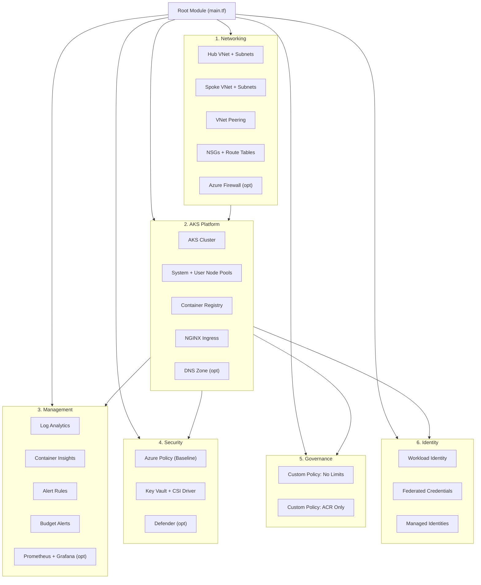

# Landing Zones

## Overview

The AKS Landing Zone Lab organizes infrastructure into **six landing zones**, each responsible for a specific domain. This mirrors the [Azure Cloud Adoption Framework landing zone model](https://learn.microsoft.com/en-us/azure/cloud-adoption-framework/ready/landing-zone/) where platform capabilities are separated into independently deployable units.



---

## Landing Zone Details

### 1. Networking (`landing-zones/networking/`)

**Purpose**: Establishes the foundational network topology for all other landing zones.

**Resources created**:
| Resource | Name Pattern | Description |
|----------|-------------|-------------|
| Resource Group (Hub) | `rg-hub-networking-{env}` | Contains all hub network resources |
| Resource Group (Spoke) | `rg-spoke-aks-networking-{env}` | Contains all spoke network resources |
| Hub VNet | `vnet-hub-{env}` | 10.0.0.0/16 — centralized services |
| Hub Subnets | `snet-management`, `snet-shared-services`, `AzureFirewallSubnet` | 3 subnets in /24 blocks |
| Spoke VNet | `vnet-spoke-aks-{env}` | 10.1.0.0/16 — AKS workloads |
| Spoke Subnets | `snet-aks-system`, `snet-aks-user`, `snet-ingress` | 3 subnets in /24 blocks |
| VNet Peering | hub↔spoke | Bidirectional peering |
| NSGs | `nsg-aks-system-{env}`, `nsg-aks-user-{env}`, `nsg-ingress-{env}` | Per-subnet security rules |
| Route Table | `rt-spoke-{env}` | Routes to hub firewall (when enabled) |
| Azure Firewall | `fw-{env}` | Optional, Basic SKU, +$900/mo |
| Diagnostic Settings | `diag-*` | Logs → Log Analytics |

**Key outputs**: VNet IDs, subnet IDs, resource group names.

**Dependencies**: None (this is the first landing zone deployed).

---

### 2. AKS Platform (`landing-zones/aks-platform/`)

**Purpose**: Deploys the Kubernetes compute platform with supporting services.

**Resources created**:
| Resource | Name Pattern | Description |
|----------|-------------|-------------|
| AKS Cluster | `aks-akslab-{env}` | Kubernetes 1.29, Azure CNI Overlay, Calico, OIDC enabled |
| System Node Pool | `system` | Standard_B2s, 1-2 nodes, autoscale |
| User Node Pool | `user` | Standard_B2s, 1-3 nodes, autoscale, labels+taints |
| Container Registry | `acr{project}{env}` | Basic SKU, admin disabled |
| ACR Role Assignment | — | AcrPull role for kubelet identity |
| Public IP (Ingress) | `pip-ingress-{env}` | Static Standard SKU |
| NGINX Ingress | Helm release | ingress-nginx chart |
| DNS Zone | `dns-{env}` | Optional (+$0.50/mo) |

**Key outputs**: Cluster name, FQDN, ACR login server, ingress public IP, OIDC issuer URL, kubelet identity.

**Dependencies**: Networking (subnet IDs).

---

### 3. Management (`landing-zones/management/`)

**Purpose**: Centralized observability, alerting, and cost management.

**Resources created**:
| Resource | Name Pattern | Description |
|----------|-------------|-------------|
| Resource Group | `rg-management-{env}` | Management resources |
| Log Analytics Workspace | `law-aks-{env}` | 30-day retention, configurable daily cap |
| Container Insights Solution | `ContainerInsights` | AKS pod/node metrics and logs |
| Diagnostic Settings (AKS) | `diag-aks-management-{env}` | 6 log categories + AllMetrics |
| Activity Log Diagnostic | `diag-activity-log-{env}` | Subscription-level activity |
| Action Group | `ag-aks-{env}` | Email notifications |
| Metric Alerts (9) | `alert-*` | Node/pod health monitoring |
| Budget Alert | `budget-akslab-{env}` | Cost threshold (configurable) |
| Managed Prometheus | Optional | Azure Monitor Workspace |
| Managed Grafana | Optional | Pre-built Kubernetes dashboards |

**Key outputs**: Log Analytics workspace ID, Grafana endpoint.

**Dependencies**: AKS Platform (cluster ID).

---

### 4. Security (`landing-zones/security/`)

**Purpose**: Security controls for secrets, policies, and threat detection.

**Resources created**:
| Resource | Name Pattern | Description |
|----------|-------------|-------------|
| Resource Group | `rg-security-{env}` | Security resources |
| Azure Policy Assignment | `pol-pod-security-baseline-{env}` | Pod Security Baseline (Audit) |
| Key Vault | `kv-aks-{env}-{hash}` | RBAC-enabled, soft delete 7d |
| KV Role Assignment | — | Key Vault Secrets User for kubelet |
| CSI Secrets Store | Helm release | Secrets provider class for AKS |
| Defender for Containers | Optional | Runtime threat detection (+$7/node/mo) |

**Key outputs**: Key Vault ID, Key Vault URI.

**Dependencies**: AKS Platform (cluster ID, kubelet identity).

---

### 5. Governance (`landing-zones/governance/`)

**Purpose**: Custom Azure Policy definitions and assignments for organizational compliance.

**Resources created**:
| Resource | Description |
|----------|-------------|
| Custom Policy: Deny Pods Without Resource Limits | Ensures all pods have CPU/memory limits |
| Custom Policy: Enforce ACR Image Source | Restricts container images to project ACR |
| Policy Assignment (No Limits) | Assigned to AKS cluster (Audit mode) |
| Policy Assignment (ACR Source) | Assigned to AKS cluster (Audit mode) |

**Key outputs**: Policy assignment IDs.

**Dependencies**: AKS Platform (cluster ID, ACR ID).

---

### 6. Identity (`landing-zones/identity/`)

**Purpose**: Workload Identity federation enabling pods to access Azure services without stored credentials.

**Resources created**:
| Resource | Name Pattern | Description |
|----------|-------------|-------------|
| Resource Group | `rg-identity-{env}` | Identity resources |
| Managed Identity (Workload) | `id-workload-{cluster}-{env}` | General workload identity |
| Federated Credential (Workload) | `fic-workload-{cluster}` | Maps K8s SA → Azure identity |
| Managed Identity (Metrics App) | `id-metrics-app-{cluster}-{env}` | Metrics app identity |
| Federated Credential (Metrics) | `fic-metrics-app-{cluster}` | Maps metrics SA → Azure identity |
| Storage Account | `stmetrics{env}{hash}` | Demo storage for metrics app |
| Storage Container | `metrics-data` | Blob container for metrics data |
| Role Assignment | Storage Blob Data Contributor | Metrics identity → storage |

**Key outputs**: Workload identity client IDs, storage account name.

**Dependencies**: AKS Platform (OIDC issuer URL, cluster name).

---

## Deployment Order

Landing zones are deployed sequentially through `depends_on` chains in the root module:

```
1. Networking          ─┐
2. AKS Platform  ◄─────┘
3. Management    ◄──── AKS Platform
4. Security      ◄──── AKS Platform
5. Governance    ◄──── AKS Platform
6. Identity      ◄──── AKS Platform
```

Steps 3–6 run in parallel after step 2 completes (Terraform resolves the dependency graph).

## Adding a New Landing Zone

To add a new landing zone:

1. Create a directory under `landing-zones/` with `main.tf`, `variables.tf`, `outputs.tf`
2. Add a module block in the root `main.tf`
3. Wire up inputs from existing landing zone outputs
4. Add `depends_on` to ensure correct ordering
